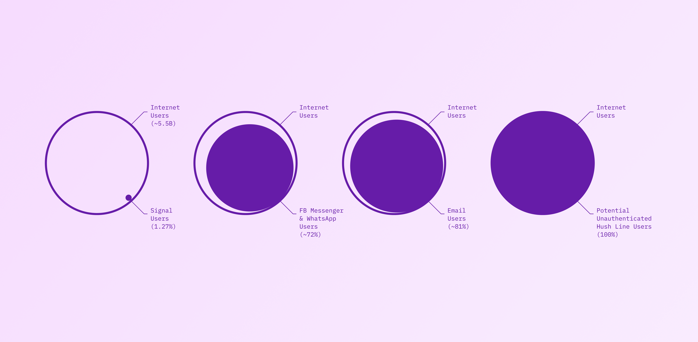
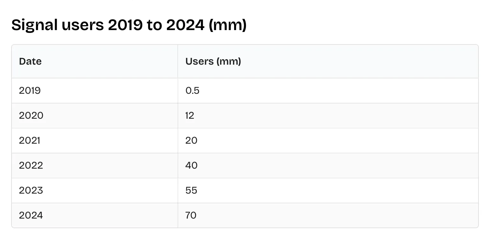
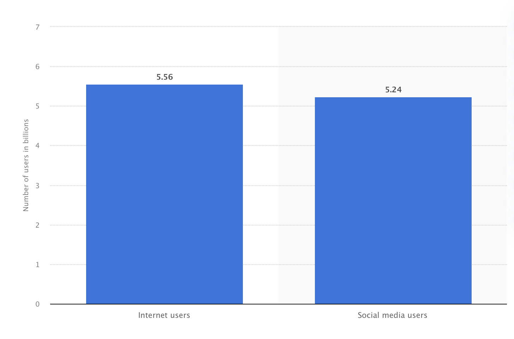
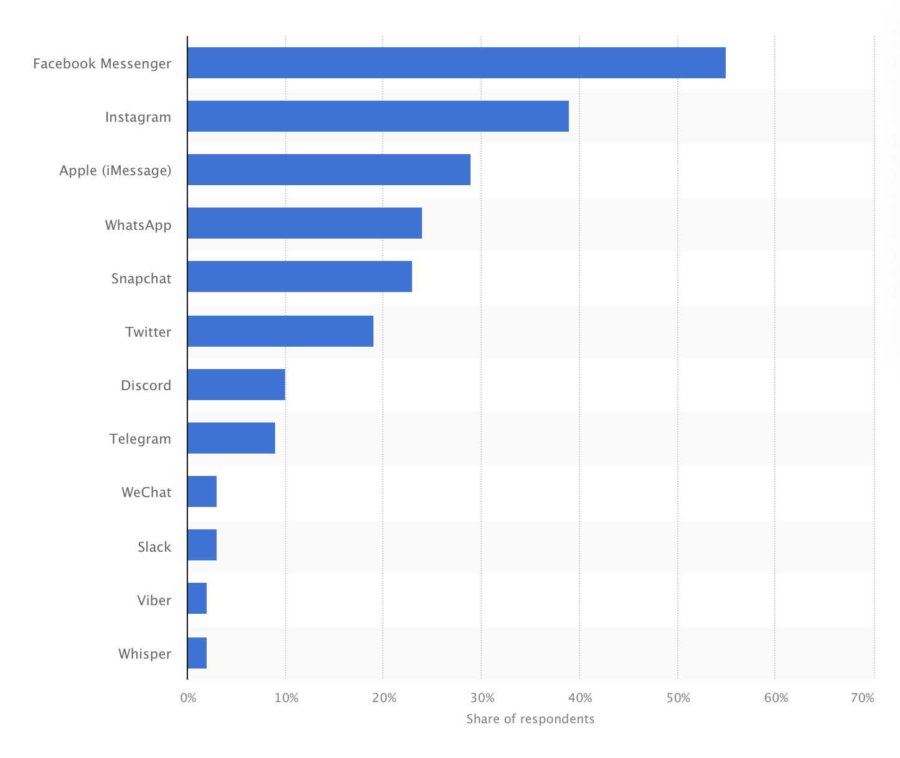
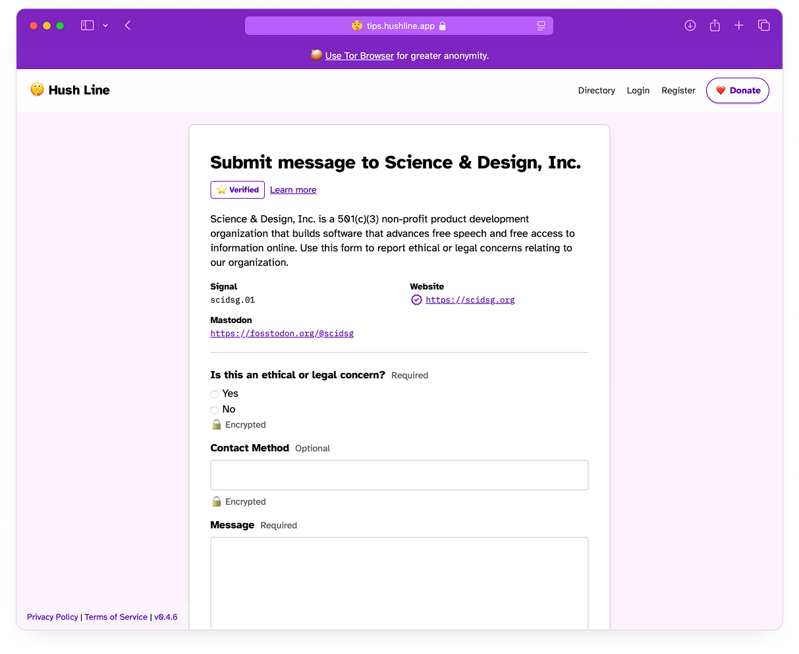

I love Signal. I was almost their first full-time designer when the team was only four people with a physical office back in the Mission in San Francisco. I turned the offer down because I was too junior in my career to feel like I could be as effective as I knew I could be with more time at the Big Tech company I worked for... 

<!-- truncate -->

...I volunteered, rejecting even being paid for my time since I had a job that paid enough. And I personally use Signal almost exclusively, so there’s no shade when I say emphatically (especially looking at you, journalists), “Signal is not enough!” Below, we’ll look at internet and messaging usage data in the United States to inform a data-informed tip line strategy.

## The Data
There’s a particular bias against anything but Signal if you’re a journalist in the US, but this bias seriously hurts your potential impact. When I worked with the team, adoption was one of the biggest problems to solve as they were hovering around 100K users, even with the stamp of approval from Snowden. Now, the app has had a nearly 700x increase in users at around 70M globally! It’s excellent news for the team at Signal — a foundation was created (just for Signal), a billionaire is their chairman, and their future is all but guaranteed.

Signal Users Globally from 2019–2024
However the total number of internet users in 2025 is ~5.5B worldwide, and Signal is but ~1.3% of that total share.

Total Internet and Social Users in 2025
Okay, so Signal might have a modest share of the total pie, but people in the US must get it, right? Looking at the top messaging apps, it doesn’t seem so. In fact, Signal isn’t in the top 10.

Top Messaging Apps in the United States
Here’s a personal story that I think about all the time. When I was working with the team, Moxie traveled down to Menlo Park to personally work with the WhatsApp team to integrate the Signal Protocol. It was a normal, slow morning when he said that it was done and deployed, almost as an “oh, by the way,” kind of thing, and it was at that moment, my mind exploded. Just like that, 1,000,000,000 (one billion) WhatsApp users worldwide had the strongest encryption on the market. Now, it’s used by two of the top four most-used messaging apps in the world, so by all counts, the scale of their positive impact deserves a Nobel Prize, in my opinion. Having said that, Signal itself isn’t among the top 10 most used apps in the United States.
A more recent story: I was visiting one of my besties, whose son I’m the godfather of, who is now 19 years old and studying cybersecurity. Since my career has been in software, and most recently in the security and privacy space, I was eager to introduce him to influential people I know and to try to give him real-world experience, maybe with work on Hush Line. “If I’m going to intro you to ppl, let’s move to Signal” I said. “What’s Signal?” was the reply to which I had to put my phone down and take a breath before replying, “Oh, young one…”

## Your Tip Line Strategy
Should you abandon Signal? Absolutely not. But it can’t be your only solution for people to reach you. Other solutions like Proton Mail have emerged as great, lower-friction options, but as of 2023, even they only have 100M users, less than 2% of all internet users.
On the other hand, email is used by ~4.5B users worldwide. But what’s better than ~4.5B users? What about everyone? Now, let’s talk about Hush Line.

Anyone internet user can send a message
Hush Line is our anonymous reporting platform that doesn’t require internet users to create an account or download any apps to use. Tip Line owners can have messages forwarded to their email service of choice, and messages are end-to-end encrypted. Someone submitting a message with an elevated threat model can use our Onion Service to access Hush Line anonymously using Tor Browser.

## Get Going
The best news? We’re free, open-source, and non-profit managed. Our team has worked on the most ubiquitous secure messaging platforms in the world, and we deeply care about making it easy for whistleblowers to find help. Are you making it harder than it needs to be for vulnerable people who need help? If you’re only using Signal, the answer is yes.
Sign up for Hush Line at https://tips.hushline.app/register.
