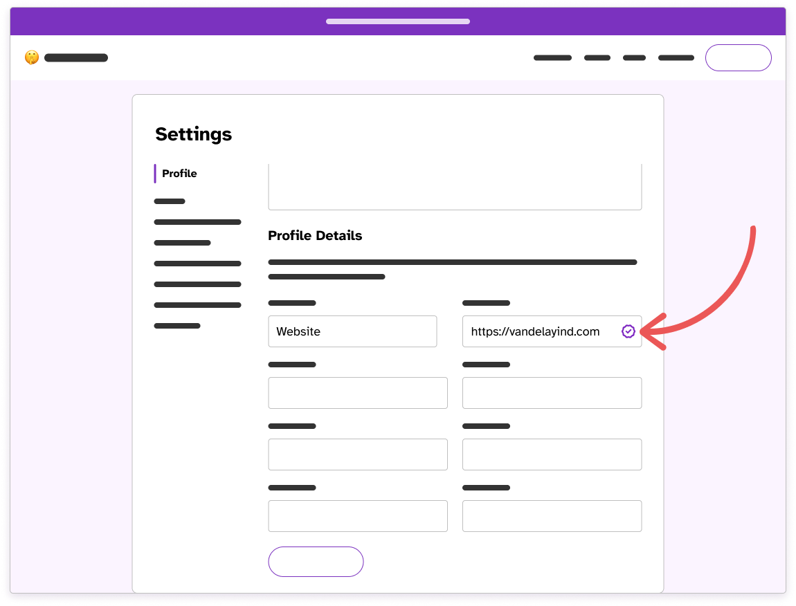
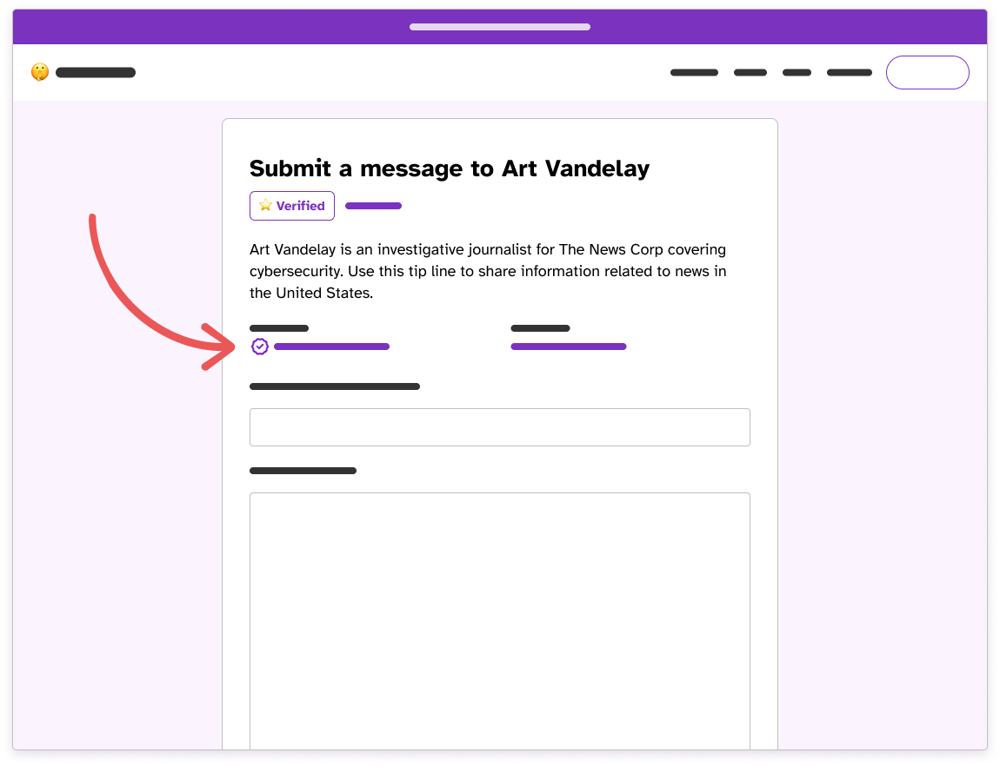

One of Hush Line's strengths is offering free Verified badges to tip line owners who want to prevent phishing attacks by adding an additional measure of authenticity to their accounts...

<!-- truncate -->

## Step 1: Link To Your Hush Line Account

On a website that you own, or if you're a legal representative of a business on a site you have control of, add a link to your Hush Line profile. It can be located anywhere, but must include `rel="me"` in the link. For example:

```
<a href="https://tips.hushline.app/to/myaccount" rel="me">Message me on Hush Line</a>
```

Note that your link doesn't have to say `Message me on Hush Line`, it just must contain `rel="me"` and point to your profile.

## Step 2: Update Your Bio

In your Hush Line settings, from the `Profile` tab, scroll to find `Profile Details`. You'll see four fields in which you can add any information that helps your community trust that your profile belongs to you. One of those fields should be to the website whose link you just added to your Hush Line address.

When you click `Update Bio` we will automatically verify that the code from Step 1 exists, and you'll see a new checkmark!



## Step 3: Check Your Profile

Once you verify a URL, anyone who visits your profile will see a checkmark, demonstrating that you own or control the listed website.



🎉 Congratulations! You now have a verified URL on your Hush Line Profile!
