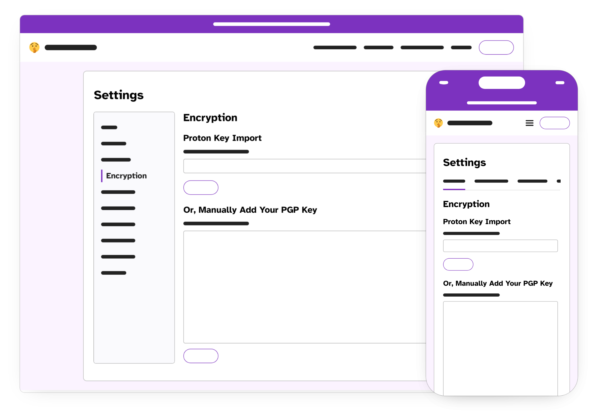
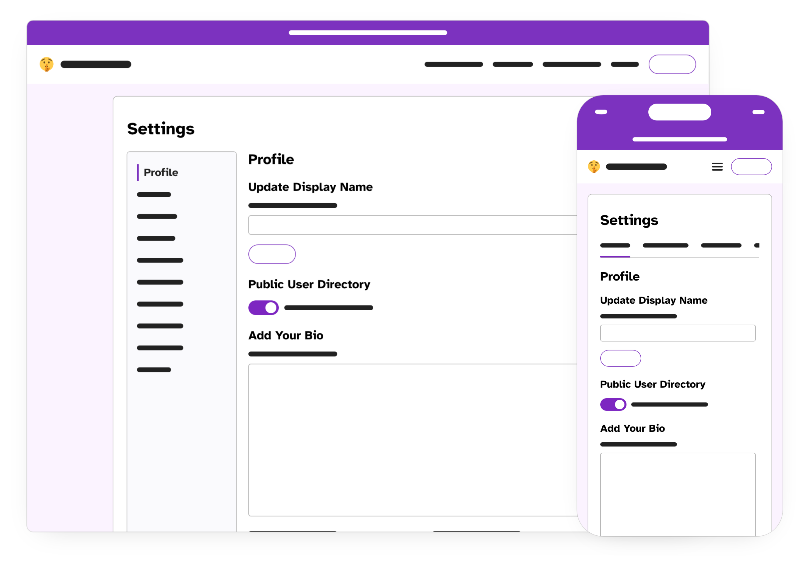
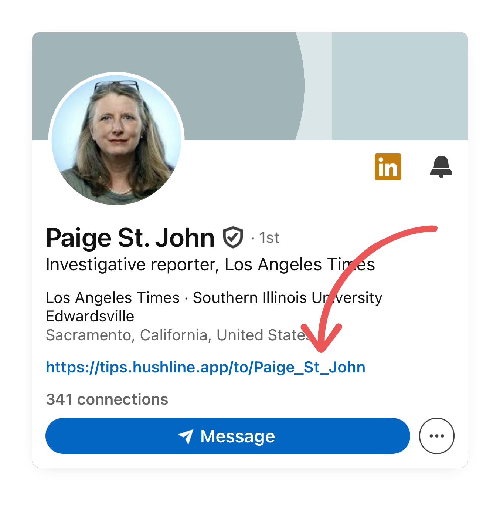
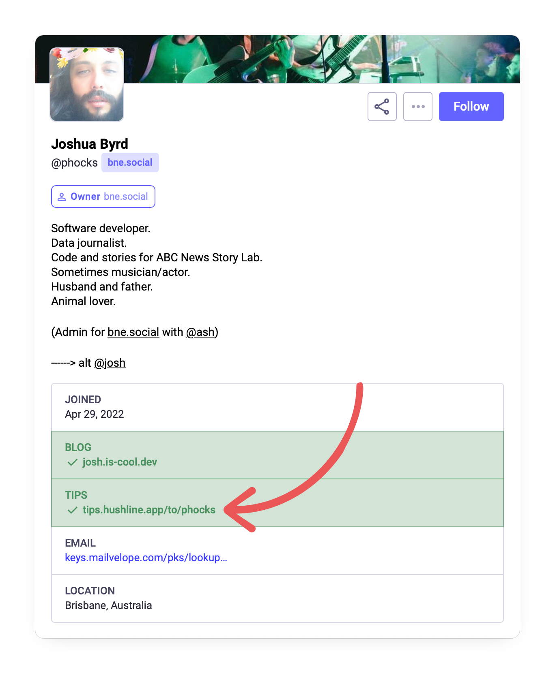
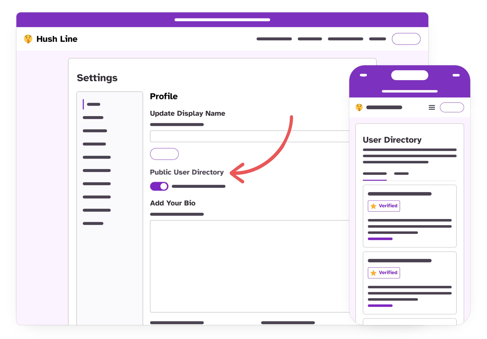
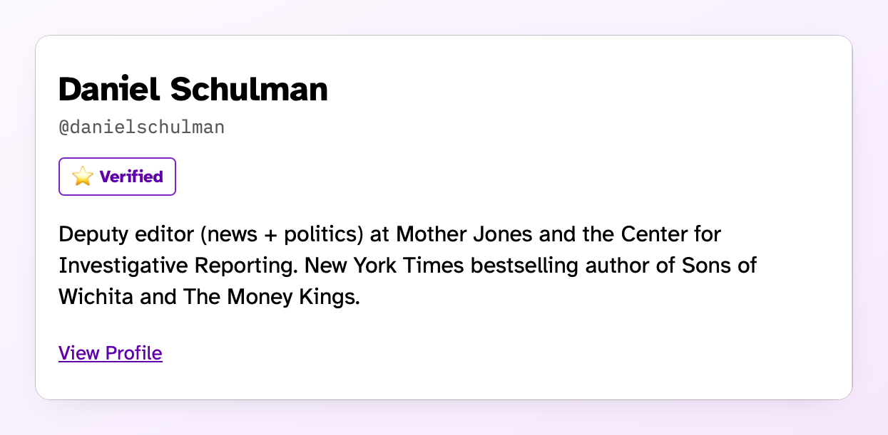

Hush Line is a general-purpose anonymous reporting tool that can be used across a range of industries. In this article, we'll explore how journalists and newsrooms can quickly get started with a Hush Line account that'll enable anyone with an internet connection to reach you without downloading a new app or creating an account.

<!-- truncate -->

I've been working on private messengers for a while. In 2016, I worked on Signal's first desktop app redesign. Around the same time, I started working on OnionShare. This peer-to-peer file transfer tool uses the Tor Network to create ephemeral anonymous connections for leaking sources to journalists. The work led me to contribute to CalyxOS, a de-Googled Android OS, for a few years and eventually join the Board of Advisors for Distributed Denial of Secrets. This non-profit publishes and archives public interest hacked and leaked documents.

I love usability. My career has been as a product designer and user researcher for a Big Tech enterprise organization, where I worked on many exciting projects, including search, identity and authentication, voice, and more. But my passion for public interest work outweighed enterprise software, and I left to start Science & Design and then create our first product, Hush Line.

## What is Hush Line?

Hush Line is a SaaS (software as a service) platform where anyone who needs a tip line can easily sign up for free. We already have journalists from ABC News, Mother Jones, Reveal, BBC, and more, and the service enables anyone in the public to reach them anonymously. Communications are end-to-end encrypted, and whistleblowers do not need to create an account or download any apps, including Tor Browser, in order to send a secure and private message that only the tip line owner can read.

We're different from other tools familiar to journalists, including SecureDrop and GlobaLeaks, because these options are self-hosted, meaning you need to run your own software or hardware infrastructure to use them. Conversely, Hush Line enables anyone to sign up for an account on a centralized service, eliminating the need for self-hosting. We're also free. Other solutions mean paying developers, buying specialized hardware, training staff, and following prescriptive workflows.

## How to Use Hush Line

After signing up, you only need to add an encryption key to start receiving messages. If you use Proton Mail, it's as simple as entering your Proton address, and we'll import your public key into Hush Line! Now, when you receive rich notifications back to that same email address, your tips will seamlessly and automatically be decrypted in your inbox!

### Add Information About Yourself

Include a descriptive bio and additional links in your profile details that point to your profiles on your newsroom websites, personal social media accounts, Signal username, or anything else that'll act as social proofs to help your community confirm authenticity.

#### Self-Authenticating URLs

Adding a self-authenticating or verified URL is easy and helps us fast-track your account verification process. Just add a link to your Hush Line profile on your website, and include rel="me" in the anchor tag. Then, add your website to your profile details on Hush Line, and you'll see a checkmark appear. [Here's a full tutorial on adding verified URLs](https://hushline.app/library/blog/how-to-verify-an-address-on-hush-line).

### Request Account Verification

We offer free verified accounts to journalists and newsrooms. Once your account is ready, send a message to the [Hush Line Admin account](https://tips.hushline.app/to/admin), including your Hush Line profile and a way to contact you if it's not already in your profile details.

## Publicize Your Address

In order for people to know they can send you messages on Hush Line, they have to know you use it! The easiest and best way to share your tip line to ensure plausible deniability for sources is to share widely. Add a link to your Hush Line profile on your social media accounts, in your email signature, on your personal and professional websites, or anywhere else someone might go to attempt to contact you.

We already have received reports that users have received helpful messages from places with censored internet access.

### Add to Your Social Profile

Fun fact: I started contributing to OnionShare because I found Micah Lee's Signal contact on his Twitter bio and reached out, and we've continued collaborating on it for years. With Hush Line, the person sending a message doesn't need to be a user of the platform or download an app, as in the case with Signal.

[Paige St. John](https://tips.hushline.app/to/Paige_St_John), a Pulitzer-awarded investigative journalist at the Los Angeles Times, adds a link to her Hush Line account on her LinkedIn profile:

[Joshua Byrd](https://tips.hushline.app/to/phocks), a journalist at ABC News, adds a link to his Hush Line account on his Mastodon profile:

### Add Yourself to the User Directory

If someone comes to the Hush Line User Directory looking for someone who can help make your profile discoverable, there can be a difference between success and failure for them. Just toggle the option in your Profile settings, and you'll be listed where visitors can find you.

[Daniel Schulman](https://tips.hushline.app/to/danielschulman), deputy editor for news and politics at Mother Jones and the Center for Investigative Reporting, has opted into the directory so anyone can send him an anonymous, end-to-end encrypted message!

## Conclusion

Setting up Hush Line is so easy you'll wonder why you haven't done it sooner. If you need assistance, you can contact us on Hush Line at https://tips.hushline.app/to/admin!
