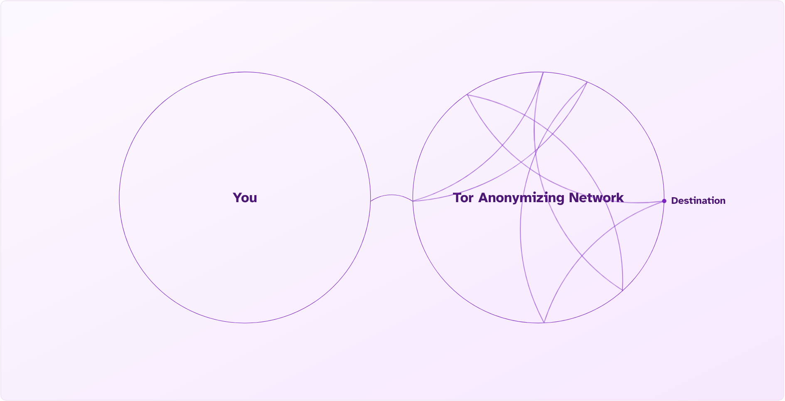

Whistleblowing software adoption is on the rise. Legislation requiring companies to have internal and external methods of confidential reporting is active in the EU, and states in the US, including California, require companies to publicize the State's Attorney General's Office hotline phone number. At the same time, federal whistleblower protections are eroding at breakneck speed.

<!-- truncate -->

If you work at a larger organization, you've probably been asked to fill out "anonymous" surveys about team and company health, ways to improve, etc. Laughably, many times, these anonymous forms are actually logged-in Google Forms that are in no way anonymous.

## DNS Monitoring

For remote workers, you're probably familiar with using VPNs to access work servers, email, or other internal-only things. VPNs for work allow you to operate as if you were in the office on an internal network. Here's an example from my home network's DNS logs:

| Time                  | Type  | Domain                          | Client            | Status                                 | Response               |
|-----------------------|------|------------------------------------|-----------------------------|---------------------------|------|
| 2025-03-16 12:18:17  | A     | tips.hushline.app             | glenns-m3     | OK (answered by localhost#5335) | IP (7.0ms)  |
| 2025-03-16 12:18:17  | HTTPS | tips.hushline.app             | glenns-m3     | OK (answered by localhost#5335) | CNAME (141.5ms) |
| 2025-03-16 12:18:17  | A     | hushline.app             | glenns-m3.pivpn    | OK (answered by localhost#5335) | CNAME (33.8ms)|
| 2025-03-16 12:18:17  | A     | checkonline.home-assistant.io | 192.168.0.166 | OK (already forwarded)     | N/A        |
| 2025-03-16 12:18:17  | A     | checkonline.home-assistant.io | 192.168.0.166 | OK (answered by localhost#5335) | IP (7.6ms) |
| 2025-03-16 12:18:17  | A     | s1.openairinfo.com            | 192.168.0.117 | OK (answered by localhost#5335) | IP (7.0ms)  |
| 2025-03-16 12:18:17  | AAAA  | s1.openairinfo.com            | 192.168.0.117 | OK (cache)                 | NODATA (0.0ms) |
| 2025-03-16 12:18:17  | AAAA  | s1.openairinfo.com            | 192.168.0.117 | OK (cache)                 | NODATA (0.0ms) |

Since I've given my computer a custom hostname, instead of seeing an internal IP address, which could tell you a lot, I can easily find my computer with a human-readable name. Now, if someone runs a company and receives a report of serious allegations of wrongdoing, they can do one of a few things: 1. take the tip, act on it, and save lots of money, or, 2. find the person who submitted the report and "fix" the problem. Most of the time, companies choose option 2. If I access the network using a VPN, the logs are no different.

So, if on March 16th at around noon, a company receives a tip that threatens to go to the press if action isn't taken, all they need to do is look back through their network logs to see who visited the tip line then. "But the system is anonymous because I didn't have to log in to submit a message!" No, sorry. "But it's end-to-end encrypted!" That only means that only the intended recipient can read the message, but in this case, I don't need to know the contents of the message; I just need to know who sent it.

## The Dangers of MDM and EDR Software

Some employers ask employees to install MDM (mobile device management) software on their personal devices. DO NOT DO THIS! MDM software enables monitoring of the contents of your phone, including the ability to add or remove apps, check your contacts, monitor your location, view browsing history and network connections, and see a full list of the applications you have installed. It's basically an administrator account run by your company. Does any app your company offers have a custom keyboard? These can log your keystrokes, so switch back to a system keyboard if possible. If your company uses EDR (endpoint detection and response) software, it can log keystrokes for forensic analysis, including texts sent over any application, including Signal.

## What to do Instead?

It's best to use a personal device on a private network or that you own, including your phone. Again, no corporate MDM or EDR software should be present on your device. One way to check if anything is installed currently is to check for "Profiles" in your phone's settings. Nothing from your company or anything else you don't recognize should be there.

### Low Threat Scenarios

In most situations, people want to report non-sensitive information. Using your personal device on a non-work network is perfect for this scenario. App owners could add IP address logging, but in this case, your IP will only show general location information. If that IP address becomes caught up in illegal activity elsewhere, law enforcement could subpoena the issuing ISP for customer information.

### Medium to High Threat Scenarios

#### Non-Onion Services

When someone does have reason to worry about using a tip line, including when disclosing serious issues of governmental corruption, national security, or other ethical or legal concerns, they may use our native Onion services. Using Tor Browser with an Onion service enables the highest levels of protection, because connections never leave the Tor Anonymizing Network. 

#### Onion Connections

When you connect to a normal website on Tor Browser, it uses a volunteer computer to exit the network and connect to that website. Theoretically, the exit computer could be compromised, and the originating requester could be deanonymized. This isn't possible using a .onion address because there is no exit connecting to the normal internet.

