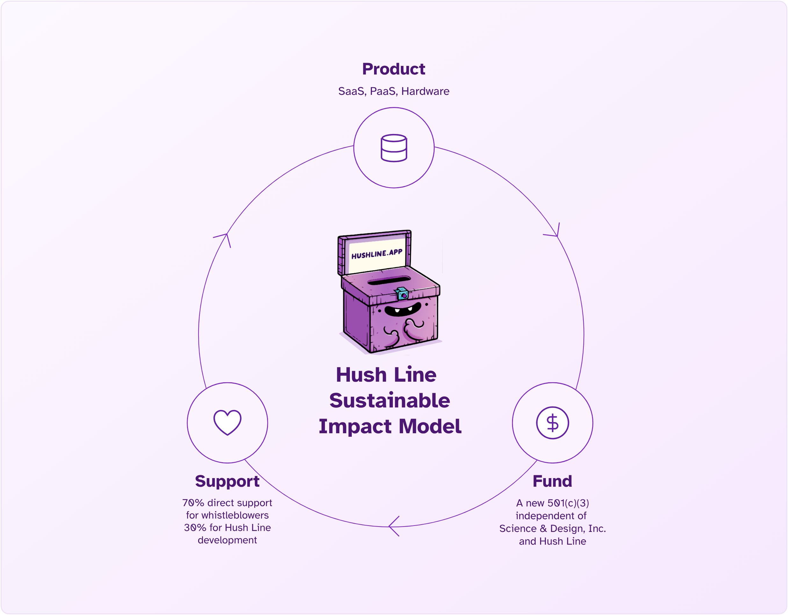
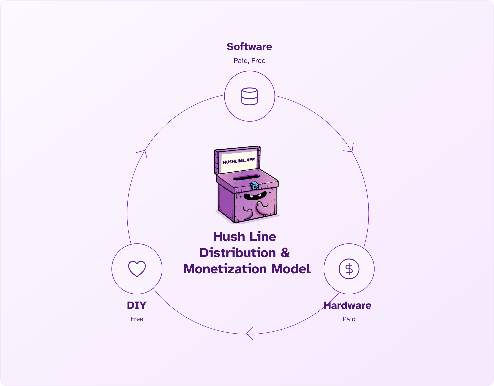

[This article is a draft and subject to update.] It's tough out there. Grants seem harder and harder to come by, and the cost of maintaining software services is ongoing. We were honored to receive a grant from the Data Empowerment Fund for $100k; it enabled us to reach a stable, robust, production-ready state, enabling our first paying customers and many more free users. But another grant we were crossing our fingers for fell through, and it's a reminder that this cannot be our primary funding source for stable, long-term infrastructure.

<!-- truncate -->

This realization is not new - I understood the scarcity of funding compared to the for-profit world. It was a lesson learned quickly, and as someone with a career as a product designer, SaaS seemed like an obvious solution to a ubiquitous problem in my new industry. This is not only an obvious solution but also one with a significant monetary upside that, and combined with our 501(c)(3) structure, offers a compelling model for self-sustainability and community empowerment.

## The Consumer Non-Profit Software Landscape

If you work outside the tech or tech-adjacent industries, you'll be hard-pressed to name a single non-profit or open-source piece of software, let alone one you use. You'll probably be able to name a lot of consumer alternatives - Google, Apple, Dropbox, Outlook, Slack - though all of these use open-source software to drive their closed-source development, their model is to charge a lot, make it expensive to leave, and lock you into a system to which you become dependent. 

### The Problem With For-Profit Software

The astronomical profits Big Tech companies make create new record levels of wealth inequality that allow Big Tech CEOs to [displace communities and businesses for their private use](https://www.npr.org/2024/02/28/1232564250/billionaire-benioff-buys-hawaii-land-salesforce). At the same time, the dream of home ownership is a fading reality for most people.

> Hawaii has long been a place where the world's elite has flocked. And tech billionaires are now among the newest cadre of migrants to buy land in the islands. Amazon founder Jeff Bezos owns a sprawling beach mansion in Maui. Facebook co-founder Mark Zuckerberg has plans to build a bunker on his land in Kauai, according to Wired. Benioff's former boss, Oracle co-founder Larry Ellison, owns 98% of Lanai. And the list goes on.

> What's different here is that rather than focusing on coastal mansions in gated communities, Benioff is buying property in a rural residential town. In the majority of instances, he's paid more than current market value, according to public records. For example, the longtime Mamane Bakery — known for its lilikoi cheesecake and mango-guava hot cross buns — shuttered after he purchased the land for more than 50% above the current market value.

### Shifting The Profit Model

The most important part is that the upside for making money is so great that a successful application of it in the non-profit sector could create generational, self-funded charities that are legally required to do good. What if instead of buying for-profit, billionaire-making CRM software, you had an alternative whose profits went to reforming corruption in business? Instead of fighting for $100,000, what if an organization could organically make 100x that and give a large portion away?

This is our opportunity with Hush Line. Anonymous reporting is a cross-industry need, legally mandated in some sectors and countries. Open-source software is our development model, enabling community review of our source code and other organizations and individuals to use our software for free. Even though anyone can install our platform themselves, we understand that most people and organizations are non-technical and cannot operate and maintain their own software infrastructure. Additionally, if you're buying security software, it's imperative to know that the code treats your data the way the makers say it is.

## Monetization & Distribution Model

### Software

#### SaaS

If you visit hushline.app to create an account, you're using our software as a service (SaaS) platform. A free tier offers most people everything they need for a secure, anonymous tip line. We have a low-cost paid tier or licensed managed single-tenant instances for businesses or professionals who require more features. For high-risk tip line owners who do not want to trust any third-party services, we offer a hardware device that runs Hush Line locally as an Onion Service. For developers, hobbyists, or businesses with technical proficiency, anyone can freely install and use all of Hush Line's features.

#### PaaS

Some organizations may want their own independent app and infrastructure instead of using `hushline.app`. In this case, we offer managed single-tenant instances that are perfect for all sizes of business.

### Hardware

Higher security and anonymity are critical for their work for a smaller audience—human rights defenders, investigative journalists, or high-profile lawyers. We offer devices for $500 that are fully self-contained, Tor-only Hush Line instances. If your threat model is one in which you cannot trust any third-party infrastructure, this is your best option.

## The Opportunity

If successful, the market opportunity will be [$238m in 2025, growing to over $300m in 2032](https://www.coherentmarketinsights.com/market-insight/whistleblowing-software-market-4595
). Even on the very low end, becoming profitable is possible. It only takes about $3,000 to operate Hush Line's software annually. Once we surpass the point of platform financial stability, we will have money that will go toward more than making a few people rich.

## Whistleblower Fund

As with any charitable cause, people are the point, and the folks we're helping are whistleblowers. These individuals often lose their careers and life savings and can suffer from significant mental health issues. To address this, we're starting a new whistleblower fund that will directly support whistleblowers' pragmatic needs, with a small portion reserved for the development and maintenance of the Hush Line platform. 

### Governance

Though the specifics are undecided at the moment, the fund may be a new independent non-profit, governed by former whistleblowers, whistleblower lawyers, and others. 

### Funding Goals

If we chose a 70/30 distribution model, we would need recurring $1,000/mo donations, combined with sales, to "keep the lights on."

Ideally, we could afford ~10 hours/mo for an engineering contractor, around $2,000. To get to this amount, we'd need to raise or earn around $7,500/mo with the same 70/30 distribution for Hush Line to earn enough to cover everything needed. Eventually, as the fund grew in popularity, we could even sustain a full-time team.

In a perfect world, we can have a full team, which would require about 6-12 people, requiring $6,000,000 ARR (annual recurring revenue), giving Hush Line a $150,000 monthly budget, and providing $350,000 every month for direct whistleblower support!

#### Financial Support With a 70/30 Distribution

| Milestone | MRR | ARR | Monthly Hush Line Support | Monthly Whistlblower Support
|--|--|--|--|--|
| 💡 Keeping the lights on | $1,000 | $12,000 | $300 | $700 | 
| ❤️ 1 Contractor, Infra | $7,666 | $92,000 | $2,300 | $5,367 |
| 🤩 Shangri La (6 Full-Time Employees, Infra) | $500,000 | $6,000,000 | $150,000 | $350,000 |

## Obstacles

While it seems straightforward, we face significant obstacles. The new organization governing the fund still needs to be formed. Will a 501(c)(3) be approved that explicitly supports whistleblowers? Federal staff have been laid off in record numbers, and the regulatory situation in the US government is tenuous at best.

Adoption is the largest barrier to success. While we don't need much, we're the new kid on the block, and as a non-profit with exactly $0 for advertising or sales as of writing this, it's a slow game. Large non-profits like Wikimedia, Signal, or Tor have a large and loyal donor-base. We're entering the industry during difficult economic and political times, and asking working people for their limited funds is a delicate thing.

There always seems to be more than one top priority when building software, but security is among the most important. Offering a centralized service makes you a target, and if we ever experience a data breach, it could cause significant reputational damage. Security is a moving target requiring constant vigilance and proactivity. Our engineering team is made up of security experts and industry leaders, but nothing is perfectly secure, and people are fallible.

## How We Get There

This year, we'll start the formation of the new fund and assemble a governing board that will ensure the funds are used as stated in our mission goals. 

The individuals who oversee the fund will have a first-hand understanding of the battles people who speak up face: whistleblower lawyers, former whistleblowers, journalists, or others who support the needs of people engaging in responsible disclosure.

Do you know someone who should be on the Board? [Reach out to me on Hush Line](https://tips.hushline.app/to/glenn)!
