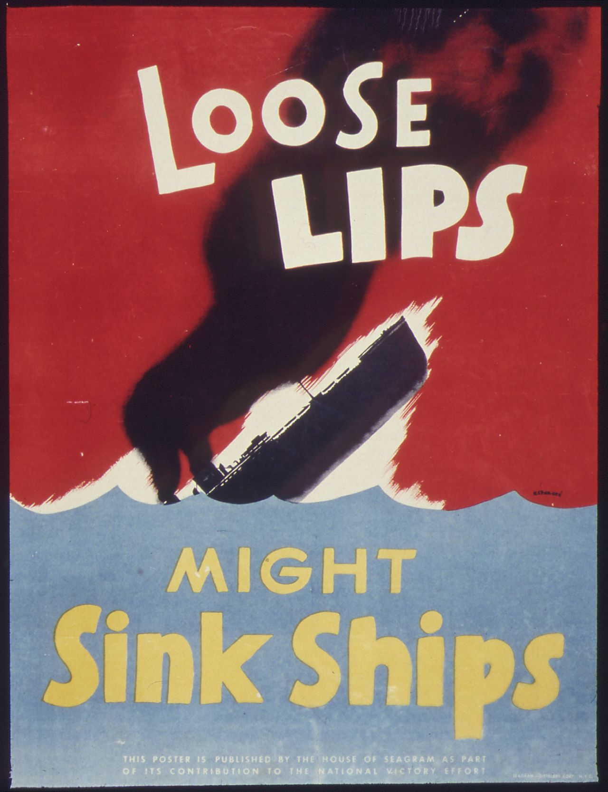
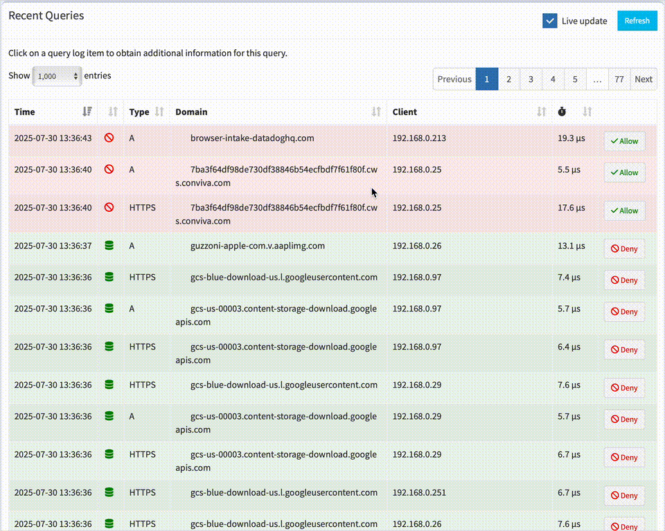

I've talked to many, many whistleblowers over the years, and the story typically goes like this: see something, say something, become the problem, lose your job, face legal and financial issues, struggle to find another job. It's the paradox of whistleblowing; we valorize doing the right thing, and then attack the people who speak up. So here's another way to blow the whistle without risking everything.

<!-- truncate -->

## Know Your Values

It's important to remember that in the hodgepodge of the office culture, there's a diversity of every kind of belief system. You aren't going to be in line politically with everyone, and that can't be a blocker for your performance. While on one hand, you must place your personal beliefs aside in some cases, in others, such as those involving legal or ethical disagreements, it's important to know where your line is.

A recent example that comes to mind is of an executive who became aware of extensive fraud within his company. Being in a leadership position, he wanted to fix the issue, but found that he was the only one willing to even talk about it. Things got uncomfortable, and realizing he couldn't make the progress he wanted, he resigned. Once the legal barrier was breached, he valued his freedom over loyalty to a company that could lead to prison.

_Takeaway: It's better to leave a bad job._

## Keep It To Yourself

We're social animals after all, so this may go against your best instincts, but if you're concerned about significant legal or ethical violations, you shouldn't confide in anyone but a lawyer with privileged conversations. Gossip is the most efficient force in an office, so if you don't want people labeling you as a risk (even the ones you're aligned with), you need to keep it to yourself.

_Takeaway: Loose lips sink ships._

## What About Internal Legal and HR?

An early lesson that everyone should learn before entering the job market is that your employer's legal and HR work for the company, not the employees. These offices are there to identify risks to the business and to eliminate liabilities. There's not much more to it than that. So even if you just got a new General Counsel or "Chief People Officer" who is young, hip, and garners trust, you are not their client or priority, no matter what they tell you.

_Takeaway: HR is not your friend._

## It's Easy To Get Caught

Are you reading this article as a concerned employee interested in blowing the whistle, and you're on your work computer? You've already misstepped. Workplace networks are almost always monitored, and the level of visibility is down to not only the website you visit, but also the web services that site uses. So if you visit nytimes.com, your employer will see that, as well as Google Analytics, or any other service the Times uses for their site. And for good reason; if you ever visit a seemingly benign site that uses a CDN in a "high-risk" country, you may be putting that network at risk. 

Below is an exmaple of basic DNS monitoring. You can see different devices automatically making network calls, with full transparency about their activity.

_Takeaway: Never use a work computer, VPN, or network to do anything whistleblowing-related._

## Document Everything, But Don't Take Documents

A key piece of information you'll need to support your concerns is your own documentation. Were you in a meeting where you were asked to do something you and the room knew to be illegal? Take note of the date and time of what you were asked to do, and who was present. Use a personal, non-work-issued phone with disk-encryption enabled (iPhone does this by default) and a strong passcode to keep notes. If you use an iPhone, make sure Advanced Data Protection is enabled so your notes and backups are end-to-end encrypted.

While it may be tempting to use your phone's camera to take photos of your work computer, you should avoid this, since that can still be considered stealing company information. In fact, DO NOT take any documents from your workplace. You don't want to break the law trying to do the right thing. Wait until speaking to a lawyer before taking anything, including forwarding emails.

_Takeaway: Taking documents, including photos of documents, can land you in jail._

## Talk To a Lawyer

You don't need a year's worth of notes before you can talk to a lawyer, and you don't need a lot of money, either. Many lawyers work on contingency, meaning they only get paid if you win. So, once you have a reasonable amount of information to support your concerns, reach out to someone who can help, ideally in your state, province, or area, who knows your local laws. You can find lawyers in the US on Hush Line's User Directory.

You don't have to show up perfectly to have a productive conversation, but when you speak to the legal professional (who can legally provide attorney-client confidentiality), make sure you sign a contract establishing that person as your legal representation. 

_Takeaway: It likely won't cost you anything to consult with a lawyer._

## Be Prepared To Drop It

Not everything concerning is illegal or unethical. If you learn that there's not a case to be made, be prepared to walk away. If you're going to risk your career, it should be for a slam dunk, not a reaching claim. And if you can't produce hard evidence, you may find lawyers hesitant to take your case.

_Takeaway: It's better to live to fight another day._

## Ready? Now, Resign

It may be a shock to hear, but if you have a strong case, you should immediately start looking for another job. "Difference in company vision" can be an adequate reason to give to your next employer for leaving your last role. Why resign? Once you're outted as someone behind a lawsuit targeting your company, everyone around you will now see you as a risk to their livelihoods. You've become a problem, and if the law keeps you in your job, it may be social ostracism and a dead-end career ladder that makes you finally leave.

The greater risk than simply being the office pariah is the stress that blowing the whistle can bring into your life. There are many stories of people spiraling into drug use, depression, and even suicide. Imagine having a career you've dreamed of your entire life taken from you because you wanted to do the right thing. Think it'll be easy to find a job after the fallout? Most whistleblowers change careers entirely because they're wearing the scarlet letter of Liability.

Many lawsuits can take years, and lawyers have methods of keeping you anonymous, at least through the most sensitive stages of the process. By the time your name comes out, you'll be in a different role at a different company, and will have more safeguards than you would from inside the organization you're in litigation against.

_Takeaway: Fight from the outside to protect yourself and your career._

## Eh, Let's Just Drop It

It's never a bad decision to take time to assess whether you want to go through with the process of disclosure. If you have a family, valued career, a high-paying job, or something else keeping you at your job, you're going to feel a strong sense of protectionism to guard what's yours, and that's good. 

If you decide to walk away from the issue you identified, AND you haven't raised any alarms internally - talking to coworkers, HR, legal, or using your computer to research the crimes you're investigating - you can safely go back to your normal life. And if you find yourself in a workplace with ethics you don't align with, it's okay to look for a new job, even if the company has a name that looks great on a resume. 

_Takeaway: Don't raise alarms, and you can make decisions without stress._
