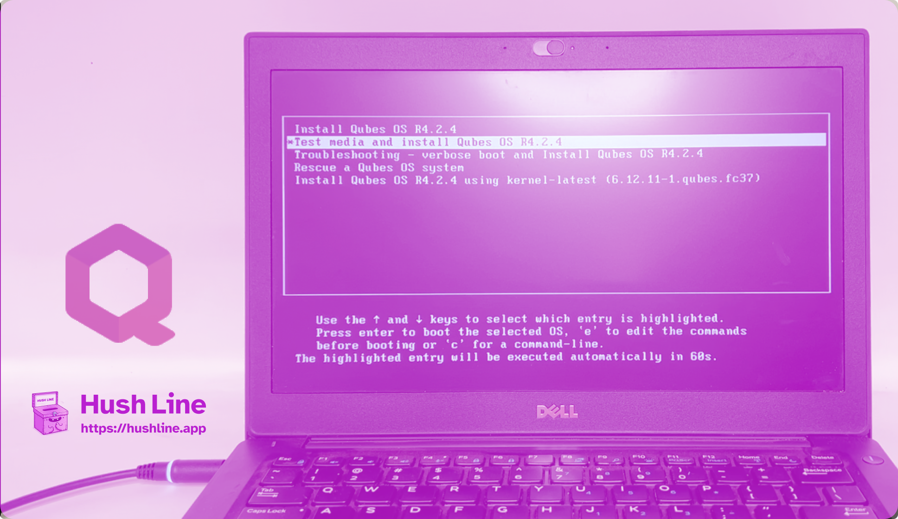
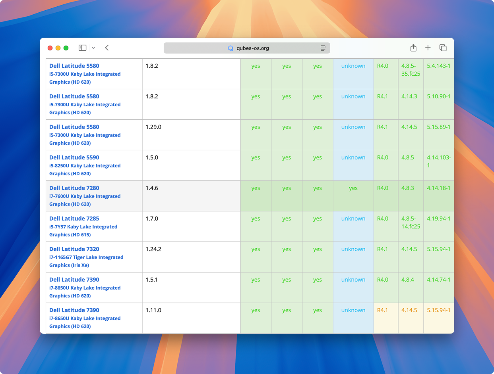
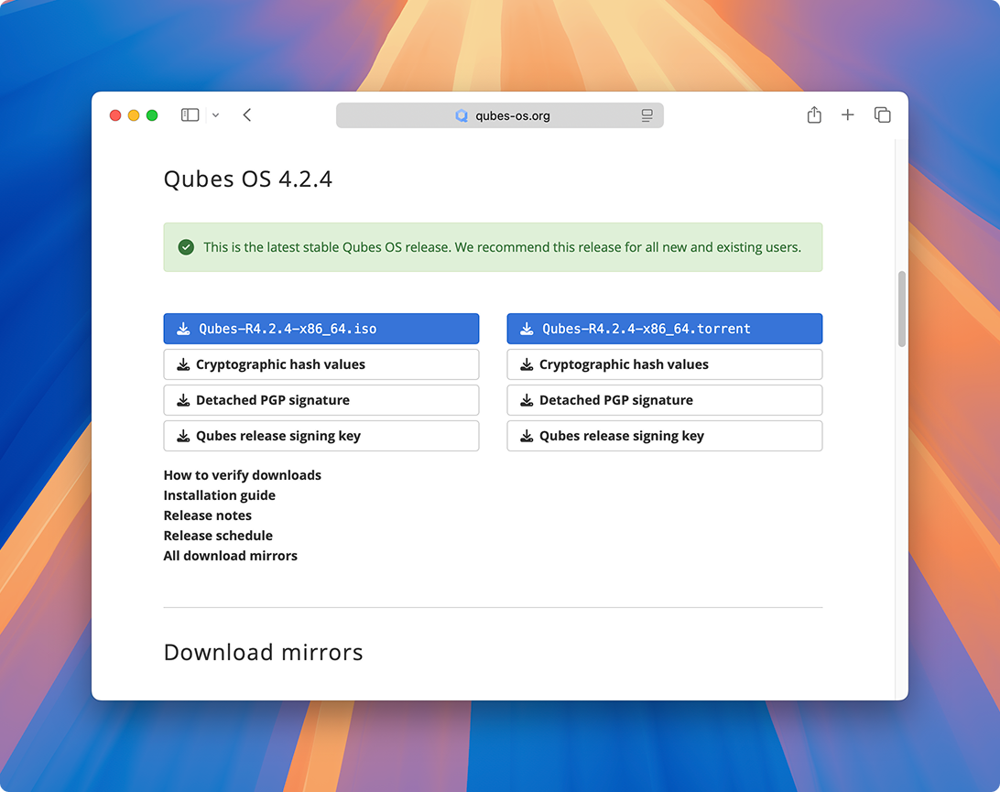
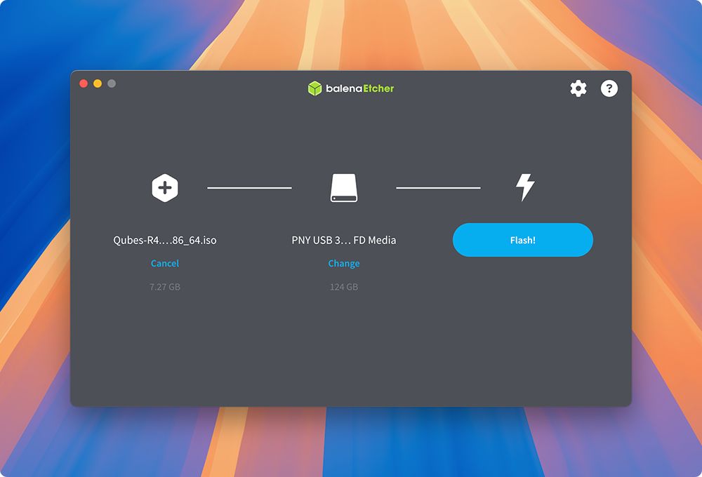

Qubes OS is widely regarded as one of the most secure operating systems available. Its strength comes from virtualization: instead of one system running everything, Qubes divides your tasks into isolated virtual machines.

<!-- truncate -->

Consider how this concept applies to your daily life. You may have a work laptop, a personal computer, and a school-issued Chromebook. Each device is kept separate for a reason—you don't want to job hunt on your work computer, or risk school monitoring on your personal device. In some cases, people handling sensitive information even keep an "air-gapped" machine that never connects to the internet, used only for opening files that pose a risk.

Qubes consolidates all of this into a single system. Work, personal, school, or air-gapped-style machines become separate virtual workstations, compartmentalized through their Xen-based architecture. These can run different operating systems, such as Fedora, Debian, Whonix for Tor, or even Windows, all at the same time.

## Let's Begin

For this guide, we’ll use a [Dell Latitude 7280](https://a.co/d/6qDgkOi), a fully supported laptop on the [Qubes hardware compatibility list](https://www.qubes-os.org/hcl/) and [available for under $200](https://a.co/d/6qDgkOi) (at the time of this writing) and convert it into a hardened, compartmentalized laptop.

First, [go to the QubesOS site and download the latest stable ISO](https://www.qubes-os.org/downloads/) of the operating system. It’s a little more than seven gigabytes, so it may take a few minutes.

Once finished, [download and open BalenaEtcher](https://etcher.balena.io), an application that allows you to write your .iso file to a USB drive.

Once you finish flashing the drive, boot up the laptop where you'll install Qubes. For the Dell Latitude 7280, when the machine starts, press the F2 key rapidly to enter BIOS setup.

In Settings, navigate to `General > Boot Sequence`. You'll see a list of drives for the laptop to prioritize; since we're installing Qubes from a USB drive, move `USB Storage Device` to the top. Apply the settings, plug the USB drive into the computer, then click Exit. Your laptop will reboot and use the USB drive containing the Qubes installer.

After rebooting, you'll see the Qubes installation options. It'll automatically select `Test media and install Qubes OS [Rx.x.x]`, but you can press `ENTER` to select it manually.

When the installer begins, you'll choose your language. Next, click `Installation Destination`. Review the information and click `Done` in the top left corner to create the disk encryption password. Ensure you use a password manager and create a strong, random password or passphrase. In the next dialog titled **Installation Options**, click `Reclaim Space` to free up the necessary space for installation.

In the following dialog, click `Delete all`, then the `Reclaim space` button in the bottom right of the window.

Next, create a user. Use a different, strong password from your Disk Password. Finally, click `Begin Installation`.

## Finishing Up

The initial installation process typically takes around 15 to 20 minutes. When complete, click `Reboot System` and remove the USB drive.

After rebooting, you'll be prompted to enter your disk password. Next, you'll see another installer screen. This time, click `QubesOS` on the first screen. The next screen gives options for configuring Qubes. The most important option here is to check `Enable system and template updates over the Tor anonymity network using Whonix`. 

This next installation can take 45 minutes to an hour. When complete, you'll log in with the user you created in the first half of the process.

🎉 Congratulations, you now have one of the most secure computers in the world, for about the cost of a trip to the grocery store.
