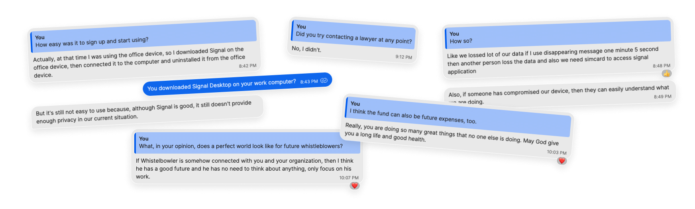

When people in tech talk about whistleblowing security, the conversation usually starts with modern encryption tools and so-called best practices. Redbull worried whether having the wrong app on his phone could place him in physical danger.

WIRED reporter Andy Greenberg [told the story of Redbull’s escape from a scam compound in Laos](https://www.wired.com/story/he-leaked-the-secrets-southeast-asian-scam-compound-then-had-to-get-out-alive/). After reading that, I talked to Redbull to get his take on the tech: what he used, how he found it, what fell apart when things got bad, and what “usable security” actually means when people are always watching.

## TL;DR

- Redbull never heard of Signal before he reached out and only learned about after a journalist replied to him.
- For him, just installing an app or having to use a real phone number could put him in danger.
- His baseline toolkit was Proton Mail/VPN, Tor Browser, and Brave.
- He said coworkers were questioned over VPN use: “He was using a VPN on his personal device, and when the bosses asked him, he gave them an excuse.”
- He didn’t try legal channels.
- Hush Line’s browser-first model (no app install required, optional Onion access) matched his need for low-friction, low-exposure messaging.

<!-- truncate -->

## The Operating Conditions

Redbull described life in narrow time windows. Phones were returned after office hours. Dorm checks happened at night. Office machines were monitored. Social accounts were logged in on the leader machines. Personal phones were periodically searched.

"They track all our online activity," he said. "They check us physically."

## Privacy Conscious, But Still Not Safe

Redbull studied computer science in India. Before contacting any journalist, he was already using Proton Mail, Proton VPN, Tor Browser, and Brave.

“I have always been privacy conscious,” he told me. Then he added the part most security teams miss: “But not everyone has this type of knowledge.”

I asked, “So that kind of software wasn’t suspicious to the people who would search your phones?” Redbull answered, “Yes, but sometimes it happens to one of the guys. He was using a VPN on his personal device, and when the bosses asked him, he gave them an excuse.”

## Hint: Signal Isn't Ubiquitous

Redbull found Andy through Google after contacting many outlets and authorities.

He described the outreach this way: “Many people, including everyone from the FBI, Interpol, Indian authorities, other news outlets, and many other journalists, I sent them, but only Andy responded to me.”

He had not used Signal before that.

“Actually Andy introduced me to Signal in an email. I was not aware.”

In this case, discovery and response determined what happened next. He did not know Signal until a reporter introduced it, and most of the institutions he contacted did not reply. When replies are slow or absent, people in danger have fewer choices and end up taking bigger risks.

## “Install the App” was a Risk

Once Signal entered the workflow, the setup itself became dangerous.

Redbull told me he installed Signal on an office device, linked it, then removed it. He described hiding it by making it look like a system drive shortcut.

“It would have been dangerous if they had known,” he said.

His critique of Signal was operational:

- Phone-number registration was a liability in his context.
- Disappearing messages protected him but also erased useful context too quickly.
- A compromised endpoint could expose everything anyway.

“Signal is good,” he said, “but it still doesn’t provide enough privacy in our current situation.” The SIM requirement was a core part of that concern. He told me, “we need simcard to access signal application.” In a setting where device checks were conducted and the communications infrastructure was controlled around him, acquiring and using a number-linked account was a potential point of exposure.

## Legal Pathways as a Nonstarter

I asked whether he contacted lawyers: “If I contact any lawyer or any Laos authority, they would definitely put me in danger and might even kill me. You understand, when a very, very big authority does not respond to my email, at that time I had limited time and was also in a rush.”

He also said he did not know where to start legally while he was still inside the compound, and that his immediate priority was getting any trusted response from outside. In practice, he first contacted journalists, NGOs, and law enforcement channels.

Trust was another factor. He described actively vetting the one reporter who replied before speaking in depth, and said he feared that reaching out to the wrong person locally could expose him. In his words, contacting a Laotian lawyer or authority felt like something that could “put me in danger.”

From a design perspective, this matters because many “best practice” disclosure flows assume stable access to counsel. In extreme environments, that assumption can fail.

## Cost and Aftermath

Redbull estimated around $800 USD in direct costs tied to disclosure and exit planning. He also described continued impacts to his mental health, “My mind is not working well right now. I forget everything.”

In other words, the burden is not only digital. Housing, transport, food, medical care, and mental health determine whether someone can keep cooperating safely after first contact.

## What he Noticed About Hush Line

When I walked him through Hush Line, the features that stood out were not novel crypto claims. They were friction reductions:

- works in a browser
- no required account for sources
- no mandatory app install
- clear-net and onion access

"It seems very easy to use and share whatever, and then exit," he said.

He also reacted positively to not requiring app-store installs tied to personal identifiers.

That feedback tracks with what his threat model demanded all along: minimal steps, minimal trail, fast exit.

## Why a Whistleblower Fund Matters

I told Redbull that I want Hush Line to start a whistleblower fund to cover practical costs that software alone cannot solve: emergency travel, temporary housing, phone and data bills, basic living expenses, and mental-health support.

His response was immediate: “That’s great, but I know a whistleblower gives too much sacrifice to reveal the truth.” He also told me, “you are doing so many great things that no one else is doing.”

When I asked what a “perfect world” looks like for future whistleblowers, he said: “If whistleblower is somehow connected with you and your organization, then I think he has a good future and he has no need to think about anything, only focus on his work.”

## What Software Teams Should Take From This

Redbull’s case is extreme, but the design lessons are broadly relevant to high-risk reporting tools.

- Design for discovery, not just secure transport.
- Assume installation can be the most dangerous step.
- Treat persistent identifiers as potential hazards.
- Automated deletion of messages can create workflow issues.
- Assume endpoints may be compromised.
- Reduce cognitive load for people operating under stress and sleep loss.

Most importantly, don’t mix up technical elegance with what actually works in real life.

A whistleblower in crisis is not evaluating your architecture diagram or protocol’s white paper. They are evaluating whether a single wrong tap has human consequences.

Redbull didn’t ask for, nor did he need, a perfect system, just one that didn’t make a dangerous situation worse. When I asked if I could write this article about his tech journey, he said, "Yes please you can. It's necessary."
