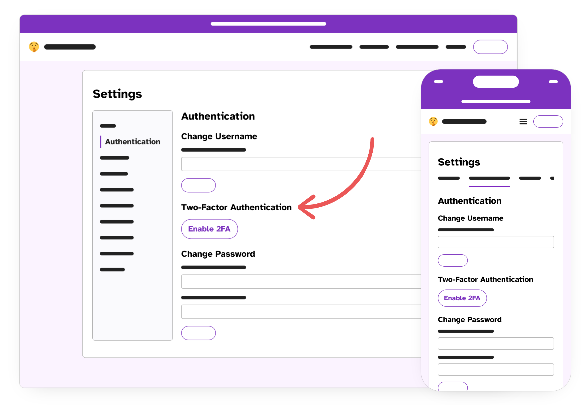

## Step 1. Enable Two-Factor Authentication

Enhance your security by enabling 2FA. In **Settings > Authentication > Two-Factor Authentication**, click **Enable 2FA**.

## Step 2. Scan the QR Code

Download an authenticator app like Google Authenticator or Aegis, scan the QR code, and enter the generated six-digit code in the “2FA Code” field.

## Step 3. Log in Again

After 2FA setup, you’ll be logged out. Log back in and enter the new code from your authenticator app.

---

🎉 **Congratulations!**  
You've set up two-factor authentication! Now we'll learn about sharing your tip line.
