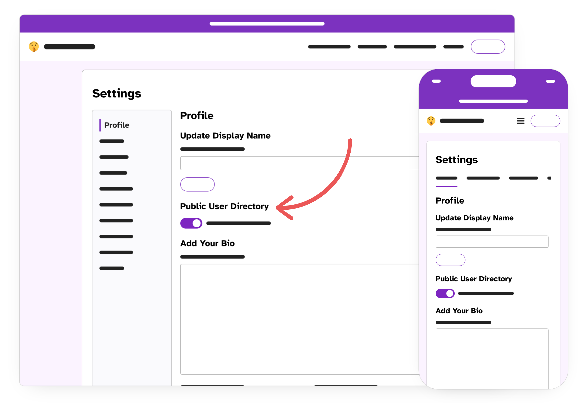
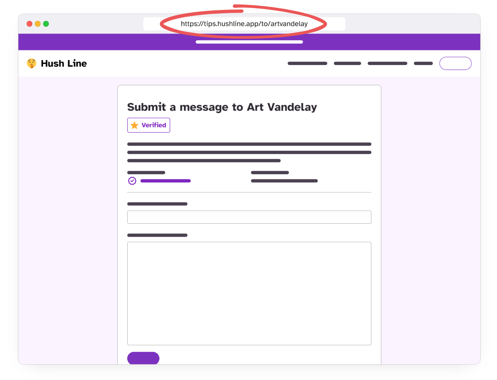
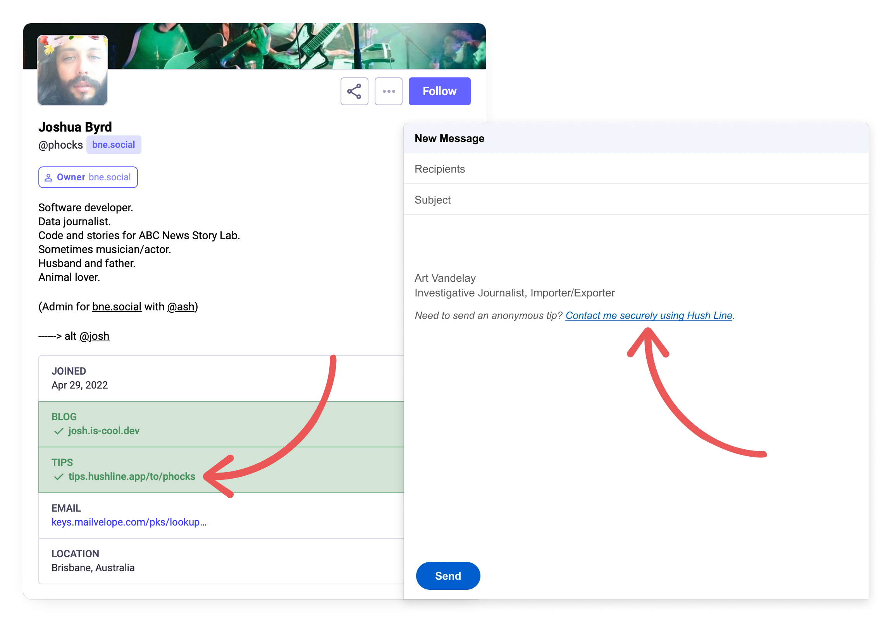

## Step 1. Make Yourself Discoverable

Opt into the public user directory in **Settings > Profile > Public User Directory** so visitors can find your account.

## Step 2. Share Your Address Widely

Add a link to your tip line on your website, email signature, and social media. To find your address go to your profile, and copy the URL in the browser's address bar:

### Examples

