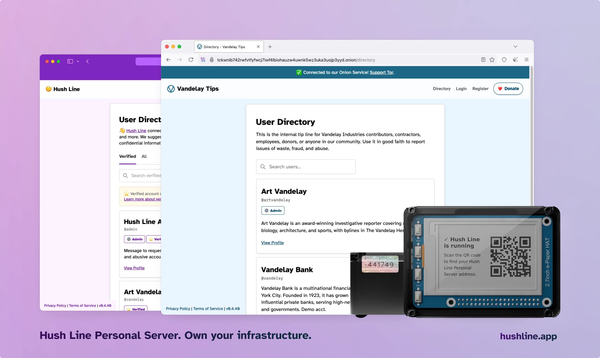
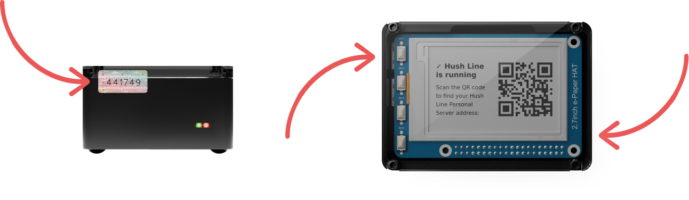
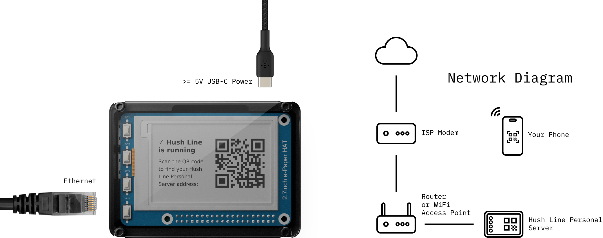
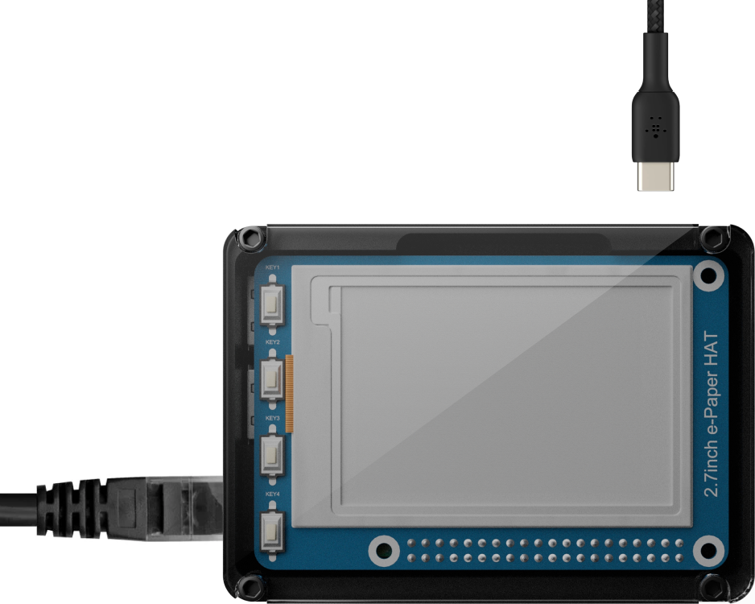
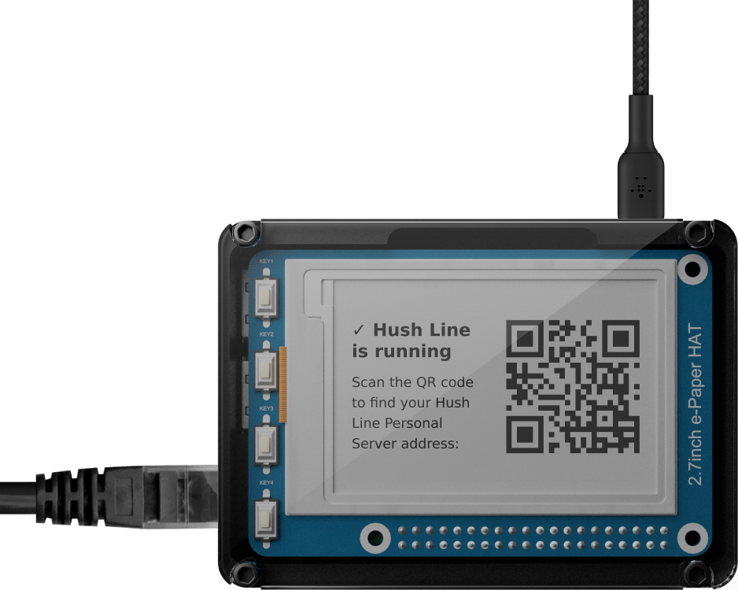
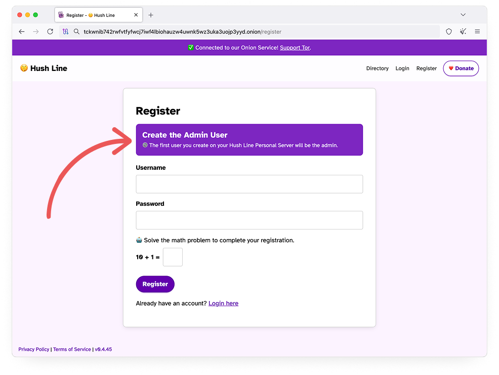

## Your Personal Tip Line Platform

The Hush Line Personal Server is a self-hosted device that gives you the entire Hush Line platform just for you. Available as a Tor-only tip line, all you have to do is plug it into ethernet and power, and in minutes, you'll have an end-to-end encrypted, anonymous, 100% local tip line. All paid features from our main app on [tips.hushline.app](https://tips.hushline.app) are unlocked forever.

Devices are [available for purchase now](https://shop.scidsg.org/products/hush-line-personal-server)!

## Security Tags

Your Personal Server comes in a box sealed with a unique code. The device also has two tamper-evident, uniquely numbered tags that seal the lid to the case. When you open the box, you'll see a card with all three numbers printed on it. Confirm they match. If they don't, contact the [Hush Line Admin account](https://tips.hushline.app/to/admin) immediately.

## Prerequisites

To use your Personal Server, you'll need an ethernet cable, at least a 5V USB-C power source, and a phone capable of scanning a QR code. The Camera app on your phone should be able to do this.

Look for extra ethernet ports on the back of the modem supplied by your internet service provider (ISP) or your personal router or Wi-Fi access point. Connect your Personal Server to one of these, then plug in your power source.

## First Boot

The e-paper display should be blank the first time you boot your device. If you see anything on the e-paper display before the first boot, contact the [Hush Line Admin account](https://tips.hushline.app/to/admin) immediately.

## Home Screen

After a few minutes, you'll see the screen flash to show the splash screen with our logo and then the home screen with a QR code and instructions. The QR code embeds a contact card with your Personal Server's Onion address. If your contact book is encrypted, you can save it as a contact for easy retrieval.

## Setting Up An Admin Account

The first account created on your Personal Server is the administrator account, so before you share your address, set this up.

