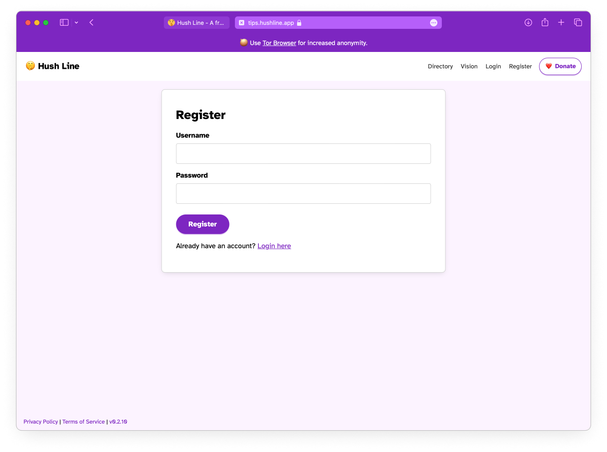

# Create a Hush Line Account

Thank you for signing up for a Hush Line account! Together, we'll help guide whistleblowers to the most successful outcomes: anonymity, repairations, and change. Hush Line accounts are intended for individuals and organizations who need a safe tip line solution for their employees, sources, and communities.

👉 To create an account head to [https://tips.hushline.app/register](https://tips.hushline.app/register).

We require no personally identifiable infornation (PII) to create an account, including email address.

## Best Practices For Your Password

- Use a "passphrase" for your password. For example, instead of using a password like `3p3mSq7T%Hr2dZ^rDTuW`, use random words you can easily remember mixed with special characters and a number like `Freestyle-Liqueur-Survival2`.
- Do not reuse passwords from other sites.
- Consider using a password manager to store your account credentials.

