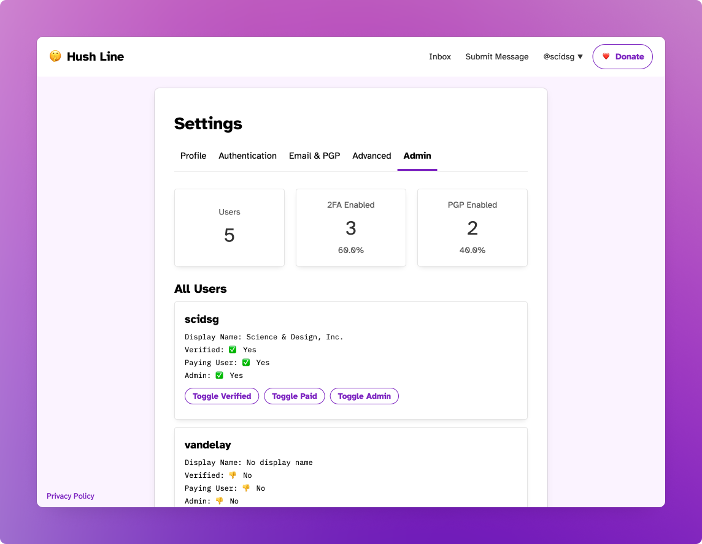

# Admin View

Admins can control certain aspects of user settings without having to log in to the server or manually modifying the database. This is where users are verified, where paid features can be manually enabled, or where admins can be created.

A highlight panel displays the total number of users and how many have enabled 2fa or added a PGP key. This view to help internal decision-making, like education campaigns for security best practices.

