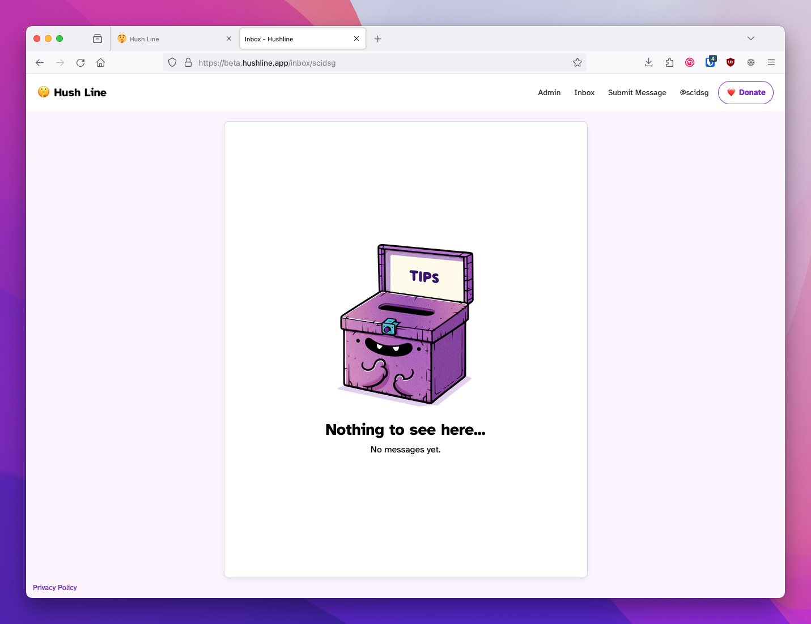
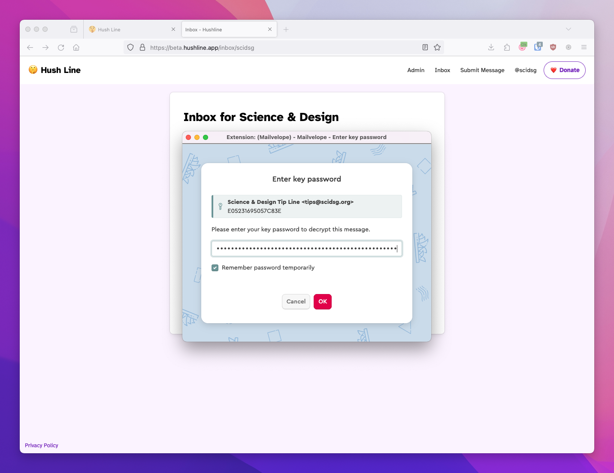
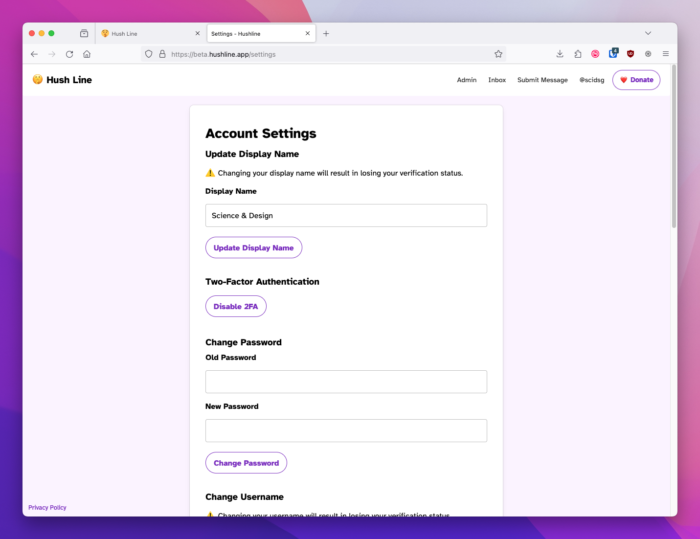

# Getting Started

The hosted version of Hush Line is the first free and open-source anonymous tip-line-as-a-service, and the easiest way to get started. It's as simple as signing up, and you'll have a way for anyone to send you a private message. It's for those needing one or more tip lines without worrying about managing and maintaining their infrastructure. 

## Sending Messages

When you log in to your account, click on the "Submit Message" link at the top of the screen. You can publicly share the URL for this page or wherever you're advertising your tip line. 

Prominently displayed at the top of the window is a heading with your account's display name. You'll see a corresponding badge if you're a verified user or an admin.

Some instructional text is only visible to you with suggestions for sharing your address. You'll also see a message indicating if you've uploaded a PGP key. This will be visible to someone submitting a message, so if you'll receive sensitive information, it is advised to add your public PGP key in Settings. 

The person submitting a message will see a tailored UI version, with messaging directed at them.

## Receiving Messages

When someone submits a message, you can view them in your Inbox. If you're using Mailvelope, you can decrypt messages directly in the app.

## Settings

Users can tailor Hush Line to their needs. We include account and message security options, as well as delivery settings.

### Display Name

Users can set a human-readable display name so that someone submitting a message can see "Submit a message to Science & Design" rather than "Submit a message to scidsg".

#### Verification

As a security measure, if a user changes their display name after verification, they'll lose that status and must re-verify their account.

### Two-Factor Authentication

To improve account security, users can enable two-factor authentication, making account compromises, even in the event of a password leak, impossible.

### Change Password

Users can change their password when needed.

### Change Username

Changing your username is easy but can lead to confusion for end-users, especially for well-known organizations.

#### Verification

Like when changing your display name, when you change your username, you'll lose verification and need to go through the process again.

### Email Delivery

Users can have messages delivered to an email address and with the SMTP service of their choosing.

### PGP

Users can opt to have their messages encrypted so they're only readable by them. This is a highly encouraged option, especially for journalists.

### Delete Account

Easily and permanently delete your account whenever you want. 

