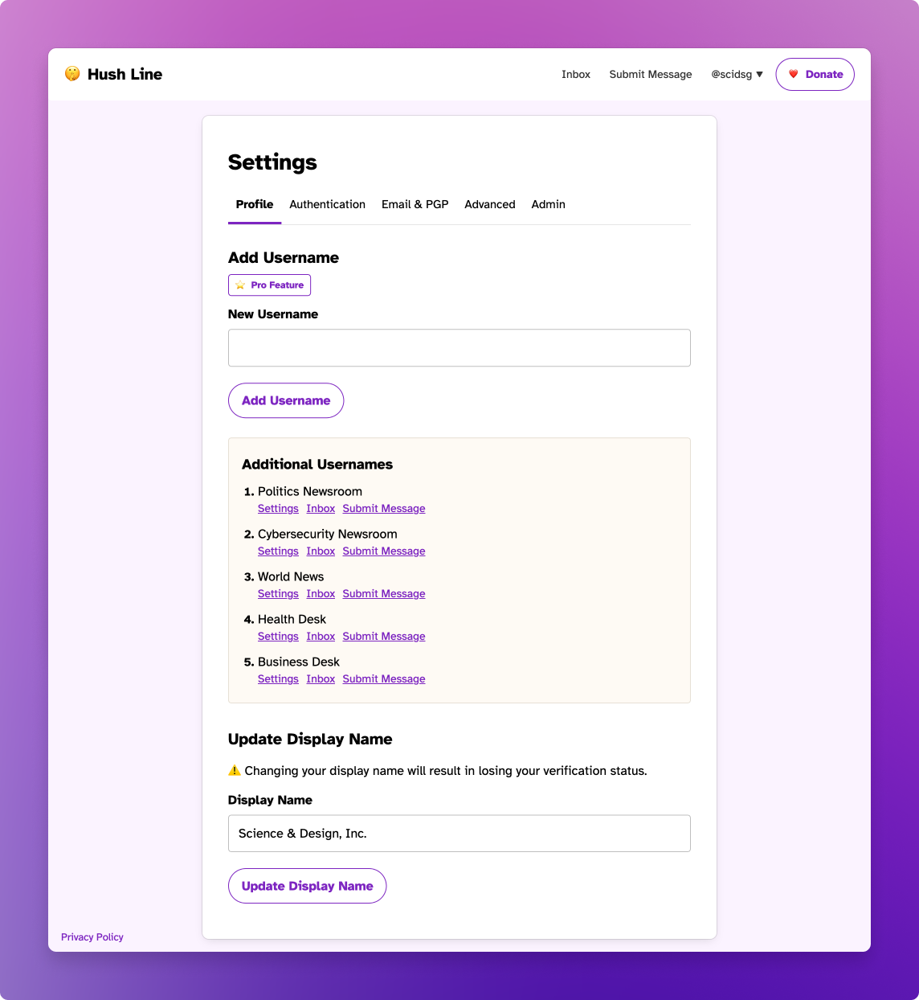
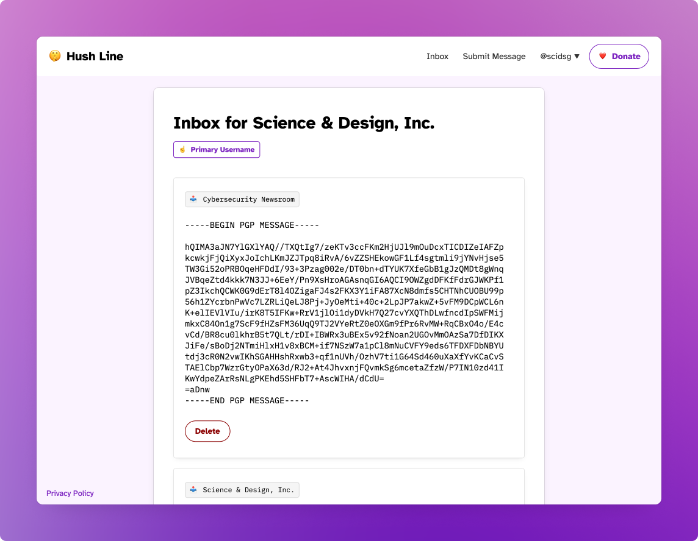

# Paid Features

## Additional Usernames

Paid users can add up to five additional usernames. This feature aims to make it easy for organizational users to manage multiple initiatives from the same account. Newsroom editors can have lines for politics, cybersecurity, or world news desks; an educational institution can have lines for students, faculty, or community channels.

## Inbox

The account's primary inbox will aggregate and label messages in a single view.

### Secondary Inboxes

Account owners can navigate to their secondary username's inboxes from the settings page.

