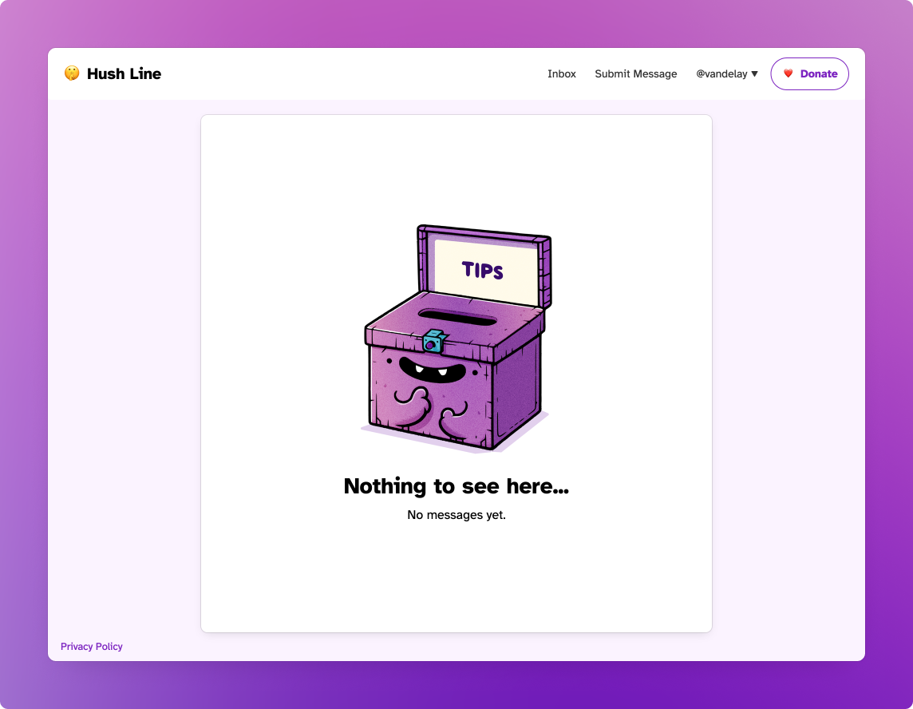
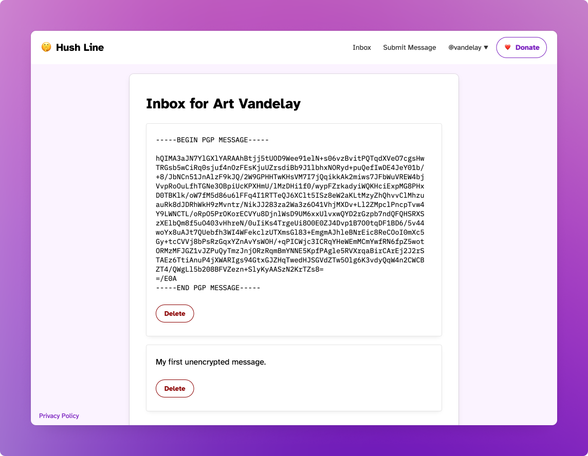
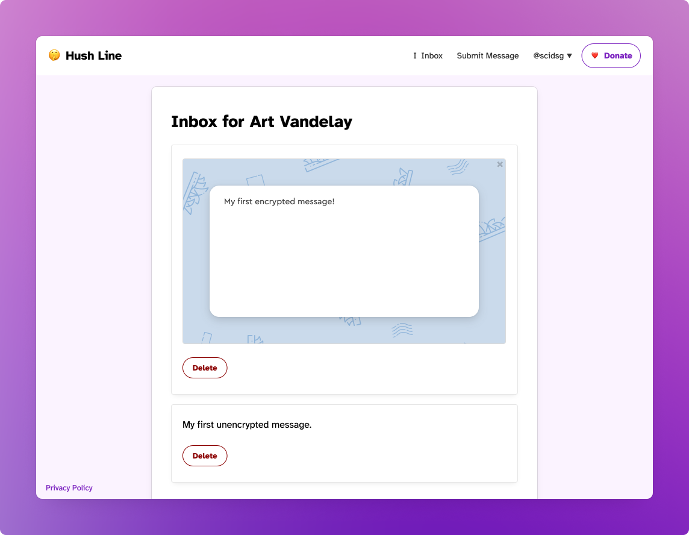

# Reading Messages

New users are greeted by their empty inbox.

When you receive a message, they'll appear here. 

## Message Encryption

By default, Hush Line doesn't require a PGP key, but it's strongly encouraged. After adding your PGP key, only you can read the messages you receive. 

As a baseline security measure, we encrypt your message content by default on our server. While this protects the contents of our database, if the encryption key becomes compromised, it can be decrypted. But if you add your PGP key, any message received will only be able to be decrypted by you. If you expect to receive messages containing sensitive content, enabling this feature is strongly encouraged.

### Mailvelope

After installing the Mailvelope extension in your browser, you can decrypt your messages directly in the app. This is highly recommended, as it's one of the easiest and most straightforward methods of decrypting your messages. 

You'll see a new interface where the encrypted message was. Click "Show message" to decrypt. You'll enter the password you created when setting up your PGP key, and the contents will be visible. 

