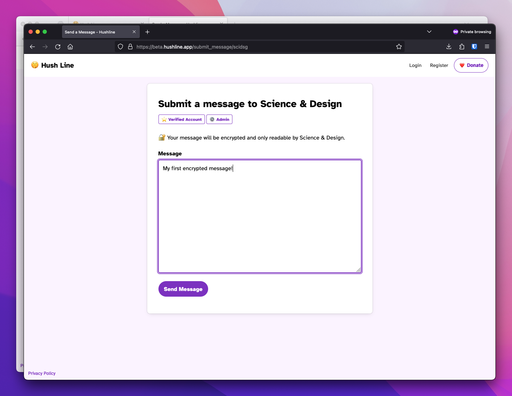

# Sending Messages

When you log in to your account, click on the "Submit Message" link at the top of the screen. You can publicly share the URL for this page or wherever you're advertising your tip line. 

Prominently displayed at the top of the window is a heading with your account's display name. You'll see a corresponding badge if you're a verified user or an admin.

Some instructional text is only visible to you with suggestions for sharing your address. You'll also see a message indicating if you've uploaded a PGP key. This will be visible to someone submitting a message, so if you'll receive sensitive information, it is advised to add your public PGP key in Settings. 

The person submitting a message will see a tailored UI version, with messaging directed at them.

