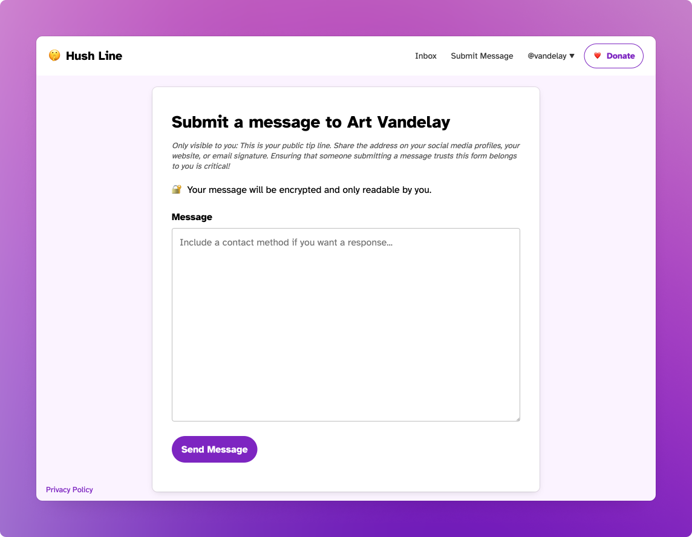
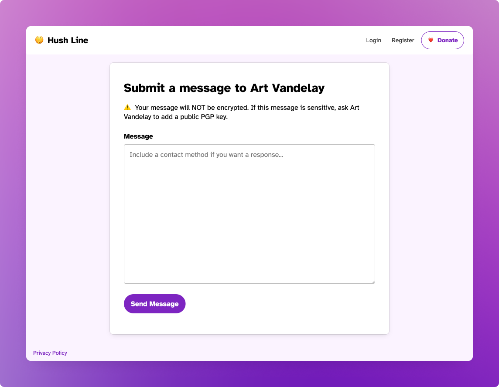

# Sending Messages

When you log in to your account, click on the "Submit Message" link at the top of the screen. You can publicly share the URL for this page wherever you're advertising your tip line. You'll notice some instructional text is only visible to you with suggestions for sharing your address. 

You'll also see a message indicating if you've uploaded a PGP key. This will be visible to someone submitting a message, so if you'll receive sensitive information, it is advised to add your public PGP key in Settings. 

When you share the address, someone sending a message will see slightly different text, with voice and tone directed at them.

If you haven't added a PGP key, you and any visitor will see a warning that messages will not be encrypted.

## Your IP Address

You notice an IP address at the bottom of the submit message form. If you ARE NOT using Tor Browser or an anonymizing VPN and you're browsing from home, the address you see is likely yours. WHILE WE DO NOT LOG ANY IP ADDRESSES, if an attacker were actively monitoring connections to the site, they'd be able to see your address. In some cases, this might be enough to de-anonymize yourself. If you ARE using Tor, the observable IP address will belong to one of the thousands of possible exit nodes on the Tor network. And since there is no predictable way to determine the origin of a Tor connection, the IP address connecting to the site can not be linked back to you.

