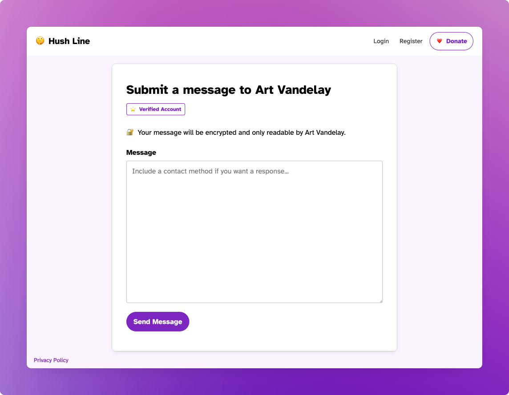
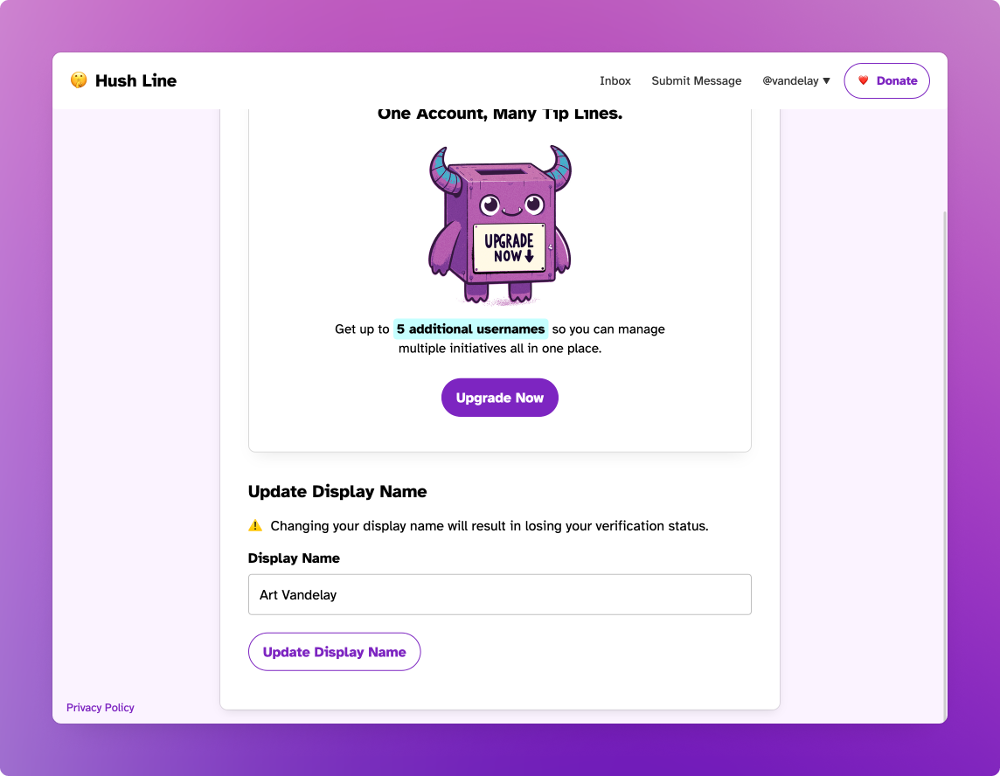

# Verified Accounts

At Hush Line, we're committed to building a trusted community where communication is secure and identities are verified. Our verified accounts feature is designed to ensure that messages reach their intended recipients, fostering a reliable environment for all users. Verified accounts are specially available for:

- 🕵️ **Journalists** - Reporters, correspondents, and investigative journalists.
- 📰 **Newsrooms** - Official accounts for newspapers, TV stations, or online news portals.
- ✊ **Activists** - Individuals or groups advocating for social, environmental, or political causes.
- 📸 **Public Figures** - Politicians or other noteworthy public individuals.
- 📊 **Businesses** - Companies, small businesses, or startups aiming to communicate with their audience.

## Requesting Verification

To ensure your account is recognized as authentic, users belonging to the categories listed above can apply for verification. Follow these steps to initiate the verification process:

1. **Send a Message:** Use the contact form in the app to reach out to us. Include your name or organization's name and a preferred method of contact (email or phone number). We'll get back to you to schedule a verification meeting.
2. **Prepare Your Documents:** To verify your identity or your authority to represent an organization, please include the relevant documents for your role:
   - **A Valid ID:** Government-issued identification that shows your full name and photo.
   - **Proof of Employment or Association:** A letter from your employer or organization confirming your role or a recent pay stub.
   - **An Active Profile:** A link to your profile on your employer's or organization's official website, verifying your position or role.
   - **Published Articles:** For journalists, links to your articles published on recognized news websites.
   - **Proof of Authority:** For those representing organizations, a document proving your authority to represent the organization, such as a power of attorney or a board resolution.

   These documents help us ensure that verified accounts are granted to the rightful individuals or representatives of organizations.

3. Prepare Your Account: Verified accounts are required to use their public name or official organization name. For example:

| Category                        | Example                                         |
|---------------------------------|-------------------------------------------------|
| Organizations                   | Vandelay Industries                             |
| Departments within an organization | Vandelay Industries, HR Dept.                  |
| Journalists                     | Art Vandelay, The Daily Worker                  |
| Independent Journalists         | Art Vandelay, Ind.                              |
| Politicians                     | Sen. Art Vandelay, D-CA, 🇺🇸                    |
|                                 | Gob Bluth, Liberal Party, Prime Minister of Canada 🇨🇦 |

Once your Display Name matches the format above, we'll promptly verify your account!

## Safeguards

To help guard against abuse, our verification system is built so that if a verified user changes their username or display name, they'll lose their verified status and need to initiate the process again. This feature is intended to eliminate the risk of a user with a verified account changing their information to impersonate another person or organization.

