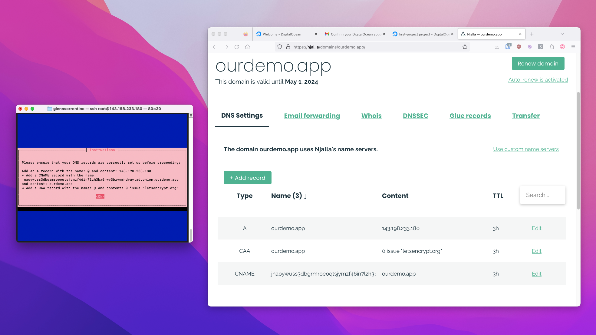

# Tor + Public Web Install

If you're someone using Hush Line for non-life-threatening scenarios - educators running a Hush Line for student reporting, or an employer for anonymous employee reporting - you might want to deploy to a public URL - one that will work in browsers like Chrome, Firefox, or Safari. We'll exclusively use a VPS. 

## 1. Run The Installer

After logging in to and updating either your Raspberry Pi or VPS, enter the following command to start the installation process:

`curl --proto '=https' --tlsv1.2 -sSfL https://install.hushline.app | bash`


Choose "Tor + Public Domain" at the first prompt for the installation type.


## 2. Add Information

Hush Line will email the encrypted Hush Line message to the account you configure here. You'll also need to purchase a domain name for your Hush Line. We'll need the following information:

- Domain name
- Gmail address
- SMTP Address: smtp.gmail.com
- App Password (from prerequisites)
- Port: 465
- Public PGP Key (from prerequisites)


## 3. Configure DNS

Now, we need to point your domain name to your new Droplet. When the installer reaches the final step, it will display the exact information that you need to enter in your domain's DNS settings.



Once the installation completes, you'll see a message that looks like this:

```
✅ Installation complete!

Hush Line is a product by Science & Design.
Learn more about us at https://scidsg.org.
Have feedback? Send us an email at hushline@scidsg.org.

● Hush Line is running
https://ourdemo.app
http://jnaoywuss3dbgrmroeoqtsjymzf46in7lzh3bx6nwv3bzvwmhdvqytad.onion
```


## 4. Confirmation Email

You'll receive an encrypted email confirming your Hush Line's successful installation which, includes your addresses and a link to download Tor Browser.


🎉 Congratulations! You've successfully set up your own public anonymous tip line! 
