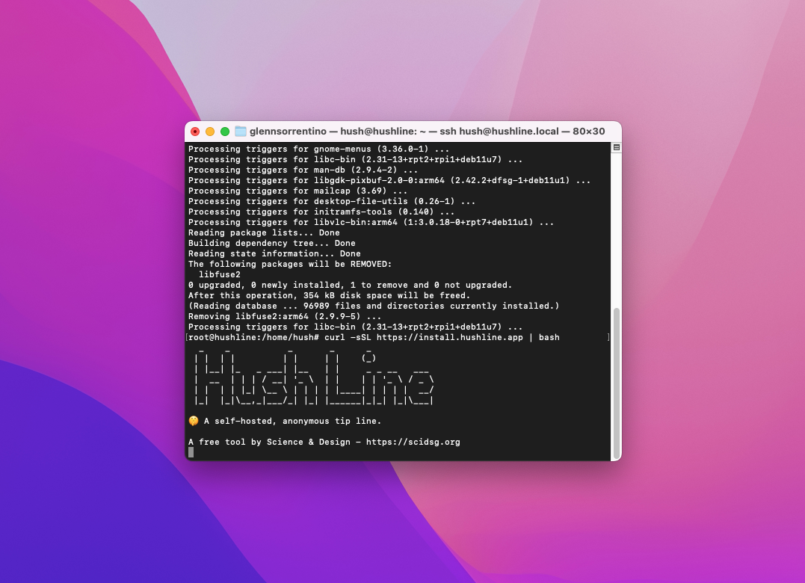
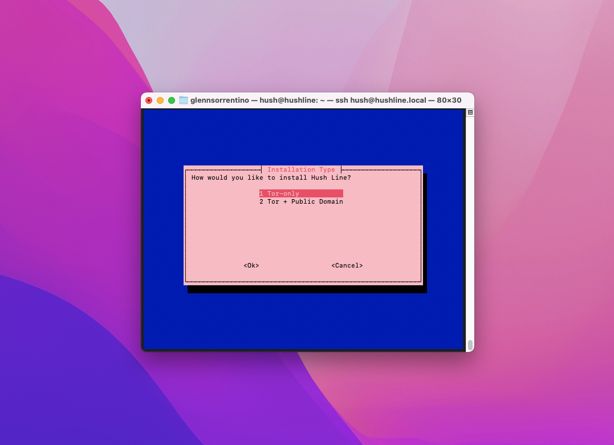

# Tor-Only Install

A Tor-only install is an excellent option for someone requiring anonymity and a high level of security, a journalist or human rights activist, for example.

## 1. Run The Installer

After logging in to and updating either your Raspberry Pi or VPS, enter the following command to start the installation process:

`curl --proto '=https' --tlsv1.2 -sSfL https://install.hushline.app | sudo bash`



Choose "Tor-Only" at the first prompt for the installation type.



## 2. Add Email Information

Hush Line will send an email with the encrypted Hush Line message to the account you configure here. Since we're using Gmail, we'll need the following information:

- Gmail address
- SMTP Address: `smtp.gmail.com`
- App Password (from prerequisites)
- Port: 465
- Public PGP Key (from prerequisites)
  


Once the installation completes, you'll see a message that looks like this:

```
✅ Installation complete!

Hush Line is a product by Science & Design.
Learn more about us at https://scidsg.org.
Have feedback? Send us an email at hushline@scidsg.org.

• Hush Line is running
http://5450rww63n5yvp5xzojb41rcx63g3pwaig63ezwp×5x75igzh×4w6qyd…onion
```


## 3. Confirmation Email

You'll receive an encrypted email confirming your Hush Line's successful installation, which includes your address and a link to download Tor Browser.


🎉 Congratulations! You've successfully set up your own anonymous tip line! 
