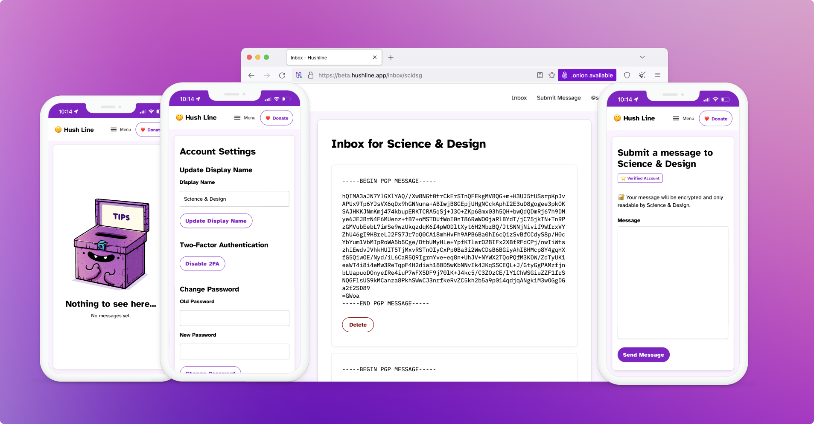
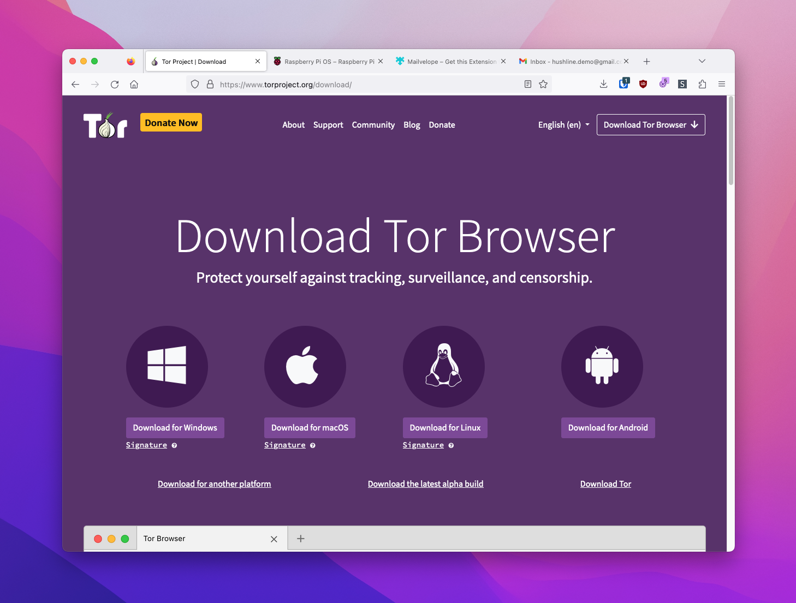
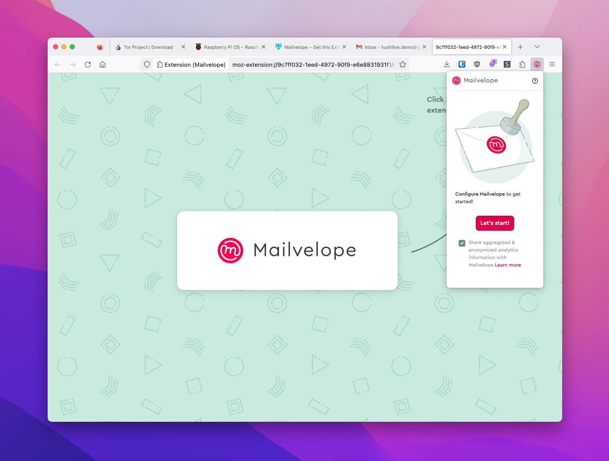
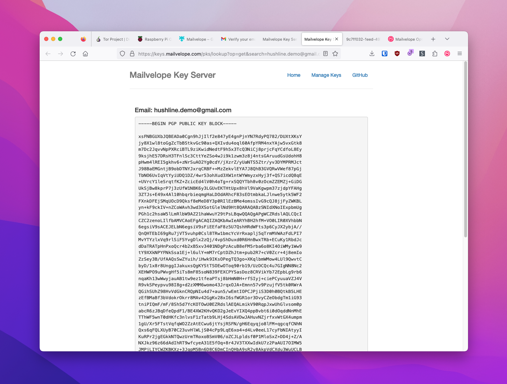
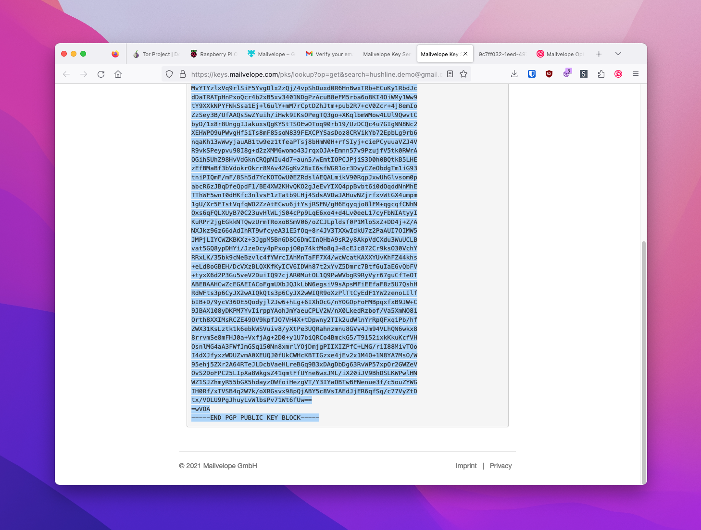
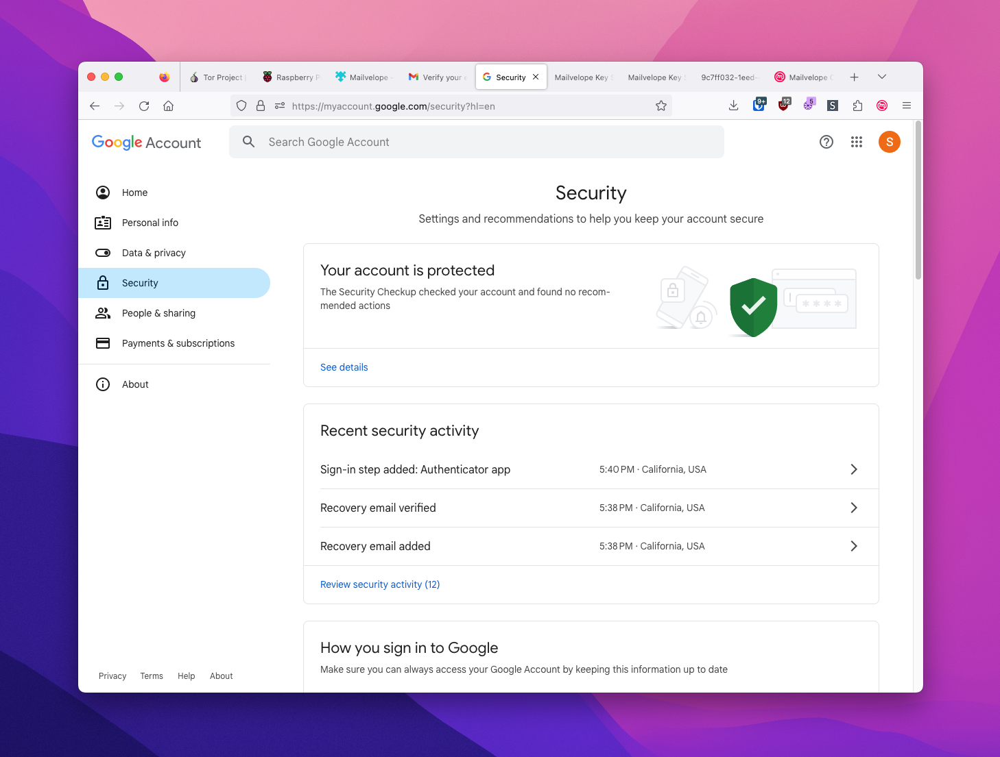
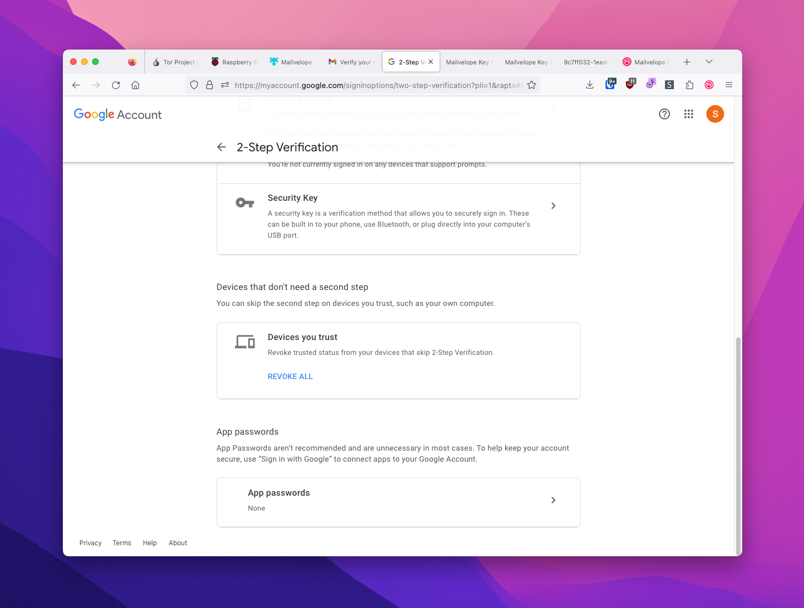

# Getting Started

## About Hush Line

Hush Line is a free and open-source, anonymous-tip-line-as-a-service for organizations or individuals. It's intended for journalists and newsrooms to offer a public tip line; by educators and school administrators to provide students with a safe way to report potentially sensitive information, or employers, Board rooms, and C-suites for anonymous employee reporting.

## Contents

1. [About Hush Line](#about-hush-line)
2. [Software](#software)
3. [Creating Keys](#creating-keys)
4. [SMTP Settings and App Passwords](#smtp-settings-and-app-passwords)

## Software

### 1. Tor Browser

Your Hush Line has the option to only be reachable via the Tor Browser. It's not only the most private but also the easiest to set up and deploy.

### 2. Gmail

We'll use Gmail for its high reliability. If you don't already have an account, create one. Having an email address separate from your personal account is a good practice.

### 3. Mailvelope

To decrypt Hush Line messages, we'll use Mailvelope, which integrates with Gmail, adding PGP functionality; add the extension to [Firefox](https://addons.mozilla.org/en-US/firefox/addon/mailvelope/) or [Chrome](https://chrome.google.com/webstore/detail/mailvelope/kajibbejlbohfaggdiogboambcijhkke).

Open the extension in your browser and click "Let's Start."

## Creating Keys

### What is PGP? Let's use a non-technical metaphor

Here's how I like to think of PGP: Once set up, you'll have a very special envelope where people can put their messages inside. These envelopes are so special that they can only be opened by one specific letter opener.

Now let's say we want to receive secret messages from your friend Bob. First, you give Bob plenty of your special envelopes. (We do not give Bob the letter opener since you don't want Bob to be able to open mail intended for you.) Bob writes his message, places it in one of your envelopes, and sends it to you. When you receive the sealed envelope, you use your letter opener to open it, confident that no one else can read its contents along the way.

### 4. Create your keys

To create our envelopes and letter opener, we're going to use our Mailvelope extension. 

Click on "Generate Keys." Give your key a name, enter your Gmail address, and create a strong password.

### 5. Verify your email address

Before using your key, you'll have to verify your email address. Look for a message from `Mailvelope Key Server` in your Gmail inbox.

The message is encrypted, and when opened, you'll be prompted for your Mailvelope password to read the email. After entering your password, click the link.

### 6. Copy your PGP key

After confirming that your email was verified, click on the supplied URL.

Your PGP Key is in the grey box, beginning with `-----BEGIN PGP PUBLIC KEY BLOCK-----` and ending with `-----END PGP PUBLIC KEY BLOCK-----`. Copy your entire key into a notepad for easy access.

## SMTP Settings and App Passwords

Hush Line has a mail server installed to send encrypted messages to your email address. You'll need SMTP information, as well as a password. You should never use your primary account password; instead, create app-specific passwords. These are purpose-made for single applications.

### Gmail SMTP
- Server: `smtp.gmail.com`
- Port: `587` or `465`

### Riseup.net SMTP
- Server: `mail.riseup.net`
- Port: `587` or `465`

### 7. Create an app password

From your Gmail account, click on your avatar to access your account-level options. Select `Manage Google Account`.

Next, click on the Security tab on the left, then scroll to the bottom of the page to find App Passwords.

Click on App Passwords, then enter a name, then click Create. A dialog will pop up with your app-specific password. Copy it to a notepad for easy access.

🎉 Congratulations, you're now ready to install Hush Line!
