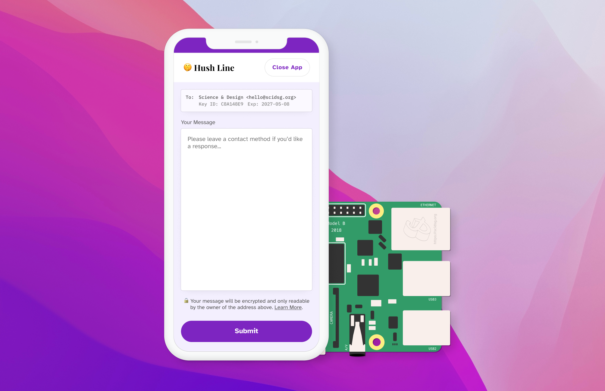
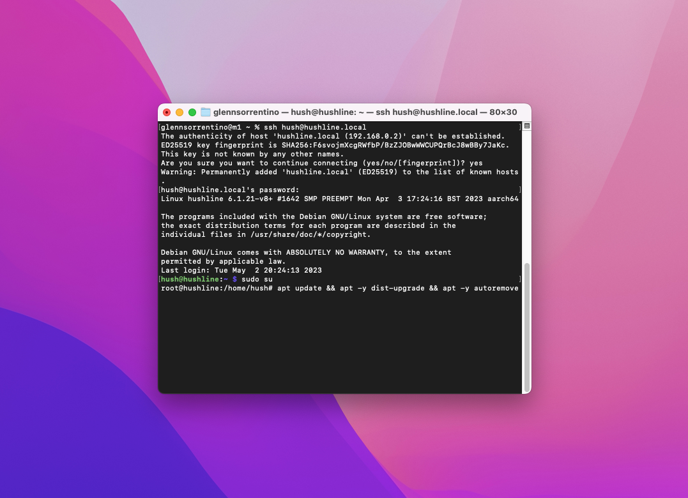
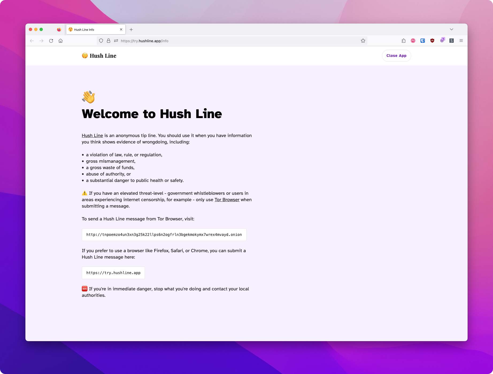
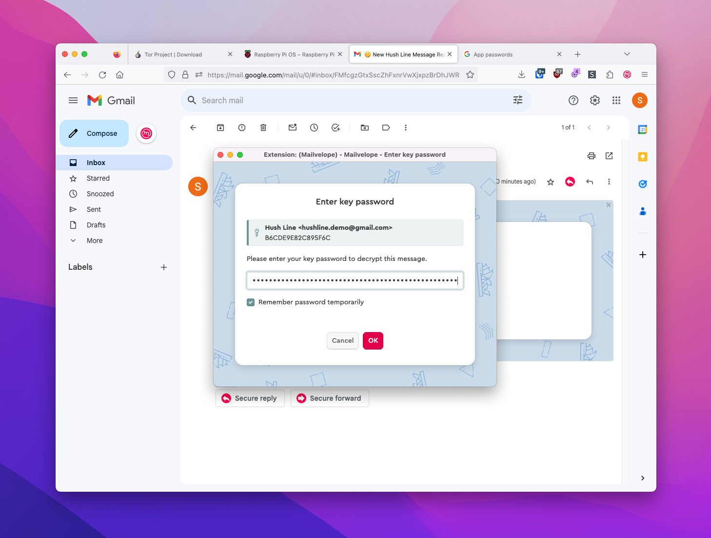

# Hush Line Self-Hosted Prerequisites 



In this section we'll get everything ready before installing Hush Line.

## General
- Download Tor Browser
- Create a Gmail account
- Create PGP keys using Mailvelope

## Raspberry Pi
- Download the Raspberry Pi Imager
- Flash a microSD card with Raspberry Pi OS (64-bit)

## VPS
- Create a Digital Ocean account
- Create a new server

## Raspberry Pi Prerequisites 

### Hardware

- **Hardware:** [Raspberry Pi 4](https://www.amazon.com/Raspberry-Model-2019-Quad-Bluetooth/dp/B07TC2BK1X/?&_encoding=UTF8&tag=scidsg-20&linkCode=ur2&linkId=ee402e41cd98b8767ed54b1531ed1666&camp=1789&creative=9325)/[3B+](https://www.amazon.com/ELEMENT-Element14-Raspberry-Pi-Motherboard/dp/B07P4LSDYV/?&_encoding=UTF8&tag=scidsg-20&linkCode=ur2&linkId=d76c1db453c42244fe465c9c56601303&camp=1789&creative=9325)
- **Power:** [Raspberry Pi USB-C Power Supply](https://www.amazon.com/Raspberry-Pi-USB-C-Power-Supply/dp/B07W8XHMJZ?crid=20ZD3IB2N877C&keywords=raspberry%2Bpi%2Bpower%2Bsupply&qid=1696270477&sprefix=raspberry%2Bpi%2Bpower%2B%2Caps%2C140&sr=8-5&th=1&linkCode=ll1&tag=scidsg-20&linkId=fa55eb4c089361952be8285bf67bfd22&language=en_US&ref_=as_li_ss_tl)
- **Storage:** [Micro SD Card](https://www.amazon.com/Sandisk-Ultra-Micro-UHS-I-Adapter/dp/B073K14CVB?crid=1XCUWSKV8V2L1&keywords=microSD+card&qid=1696270565&sprefix=microsd+car%2Caps%2C137&sr=8-21&linkCode=ll1&tag=scidsg-20&linkId=a2865a28ae852876a5a6d27512e9d7ef&language=en_US&ref_=as_li_ss_tl)
- **SD Card Adapter:** [SD Card Reader](https://www.amazon.com/SanDisk-MobileMate-microSD-Card-Reader/dp/B07G5JV2B5?crid=3ESM9TOJBH8J7&keywords=microsd+card+adaptor+usb+sandisk&qid=1696270641&sprefix=microsd+card+adaptor+usb+sandisk%2Caps%2C135&sr=8-3&linkCode=ll1&tag=scidsg-20&linkId=90d3bed4e490d29d84bcf86d9fe75290&language=en_US&ref_=as_li_ss_tl) 
- _Affiliate links_

### Prepping Your Pi

If you didn't know, your Raspberry Pi doesn't come with an operating system. Don't panic! We're going to install one now called Raspberry Pi OS.

#### 1. Raspberry Pi Imager

Like a Macbook runs MacOS, and a Dell runs Windows, a Raspberry Pi runs Linux, which comes in many different flavors depending on your needs. Since we're using a Raspberry Pi, we'll use Raspberry Pi OS (64-bit), an operating system made just for the Pi. The Imager installs the operating system onto your microSD card, where we'll set up Hush Line. Download it from https://www.raspberrypi.com/software/.


### Prep Your Card

#### 2. Install Raspberry Pi OS
Open the Raspberry Pi Imager and click `Choose OS > Raspberry Pi OS (other) > Raspberry Pi OS (64-Bit)`.

Insert your microSD card into your computer, and then click `Choose Storage` and select your card.


Before clicking Write, click on the Settings gear in the bottom right of the window. Configure the following settings:

- Hostname = `hushline`
- Enable SSH with password authentication
- User = `hush`
- Set a strong password
- Add wifi settings


### Boot up and log in to Your Pi

#### 3. Insert microSD Card

Take your SD card and insert it into your Raspberry Pi. You'll find the SD card slide on the bottom of the board, opposite the ethernet ports.

Plug the power supply into the device and let it boot up.

#### 4. Log In

On a Mac, open Spotlight search by pressing CMD + Space. Enter "Terminal" and select the application with the same name. 

Enter `ssh hush@hushline.local`, and when prompted, enter the password you created in the second step.


#### 5. Update your system

The last thing we need to do is to update our system. First, we'll give ourselves admin priviledges, then perform the update:

Enter `sudo su`, then `apt update && apt -y dist-upgrade && apt -y autoremove`.



🎉 That's it, you're ready to get started with Raspberry Pi!

## VPS Prerequisites

In this section, we'll prepare to install Hush Line on a virtual private server (VPS). This means your Hush Line will run on a rented, private server owned by a company like [Digital Ocean](https://www.digitalocean.com/).

You'll need the following things:

1. Debit or credit card
2. Digital Ocean, or any other VPS provider

### Digital Ocean

Digital Ocean is an infrastructure service provider that provides a cost-effective way to create your first virtual private server (VPS).

#### 1. Create an Account

Go to [digitalocean.com](https://www.digitalocean.com/) and create an account. You'll need to enter payment information before you can create a VPS.


#### 2. Create a VPS

Digital Ocean calls their VPS option Droplets. To create a droplet click the green "Create" button at the top of the screen, the click "Droplets."


You can configure your server to your desired specifications, but for this guide, we'll choose the following options:

- Location: San Francisco
- Image: Debian 12
- Size: Basic
- CPU: Regular SSD @ $4/mo

Create a strong password, then click "Create Droplet."


After a minute or two, your Droplet should be ready. The "Resources" tab should be visible, and just below, you'll see the IP address for your Droplet.


#### 3. Log In

On a Mac, open Spotlight search by pressing CMD + Space. Enter "Terminal" and select the application with the same name.

Enter `ssh root@<IP Address>`, and when prompted, enter the password you created in the second step.


#### 4. Update your system

The last thing we need to do is to update our system. Enter `apt update && apt -y dist-upgrade && apt -y autoremove`.


🎉 Congratulations, you're now ready to install Hush Line on Digital Ocean!

## Tor-Only Install

A Tor-only install is an excellent option for someone requiring anonymity and a high level of security, a journalist or human rights activist, for example.

### 1. Run The Installer

After logging in to and updating either your Raspberry Pi or VPS, enter the following command to start the installation process:

`curl --proto '=https' --tlsv1.2 -sSfL https://install.hushline.app | bash`


Choose "Tor-Only" at the first prompt for the installation type.


### 2. Add Email Information

Hush Line will send an email with the encrypted Hush Line message to the account you configure here. Since we're using Gmail, we'll need the following information:

- SMTP email address
- SMTP address: `smtp.gmail.com`
- App password (from prerequisites)
- Port: 465
- Public PGP key (from prerequisites)
  


Once the installation completes, you'll see a message that looks like this:

```
✅ Installation complete!

Hush Line is a product by Science & Design.
Learn more about us at https://scidsg.org.
Have feedback? Send us an email at hushline@scidsg.org.

• Hush Line is running
http://5450rww63n5yvp5xzojb41rcx63g3pwaig63ezwp×5x75igzh×4w6qyd…onion
```


### 3. Confirmation Email

You'll receive an encrypted email confirming your Hush Line's successful installation, which includes your address and a link to download Tor Browser.


🎉 Congratulations! You've successfully set up your own anonymous tip line! 

## Tor + Public Web Install

If you're someone using Hush Line for non-life-threatening scenarios - educators running a Hush Line for student reporting, or an employer for anonymous employee reporting - you might want to deploy to a public URL - one that will work in browsers like Chrome, Firefox, or Safari. We'll exclusively use a VPS. 

### 1. Run The Installer

After logging in to and updating either your Raspberry Pi or VPS, enter the following command to start the installation process:

`curl --proto '=https' --tlsv1.2 -sSfL https://install.hushline.app | bash`


Choose "Tor + Public Domain" at the first prompt for the installation type.


### 2. Add Information

Hush Line will email the encrypted Hush Line message to the account you configure here. You'll also need to purchase a domain name for your Hush Line. We'll need the following information:

- Domain name
- SMTP email address
- SMTP address: smtp.gmail.com
- App password (from prerequisites)
- Port: 465
- Public PGP key (from prerequisites)


### 3. Configure DNS

Now, we need to point your domain name to your new Droplet. When the installer reaches the final step, it will display the exact information that you need to enter in your domain's DNS settings.


Once the installation completes, you'll see a message that looks like this:

```
✅ Installation complete!

Hush Line is a product by Science & Design.
Learn more about us at https://scidsg.org.
Have feedback? Send us an email at hushline@scidsg.org.

● Hush Line is running
https://ourdemo.app
http://jnaoywuss3dbgrmroeoqtsjymzf46in7lzh3bx6nwv3bzvwmhdvqytad.onion
```


### 4. Confirmation Email

You'll receive an encrypted email confirming your Hush Line's successful installation which, includes your addresses and a link to download Tor Browser.


🎉 Congratulations! You've successfully set up your own public anonymous tip line! 


## Information Page

Hush Line deploys with an information page that provides the sender with additional information that might be helpful before submitting a message.



### When to use Hush Line

We've leaned on the guidance from [Whistleblower.org](https://whistleblower.org) and included some information from their resources for when to use a tip line. They include when you have evidence of wrongdoing, including:

- a violation of law, rule, or regulation,
- gross mismanagement,
- a gross waste of funds,
- abuse of authority, or
- a substantial danger to public health or safety.

### Hush Line addresses

If you deployed to a public domain, you'll find both your onion address and public website listed here. 

### Share it!

The information on this page can be shared and the link to the page itself should be posted in multiple locations to make it easy to verify. You can:

- print the page and place it in common areas,
- copy the info and email it broadly,
- add the info link on your website and social channels, and
- add the link in your email signature.

### Verify your address!

Before you trust any link, whether an onion domain or a public website, you should verify its address. We encourage Hush Line operators to post their address in _at least three different locations_ - social media, website, and email signature, for example - so individuals sending a message can verify they have the correct address before visiting and sharing potentially sensitive information.

## Sending Messages

For someone in your community to send you a Hush Line message, they just need to go to one of your addresses and enter their message.

### 1. Tor

If you chose a Tor-only deployment, you should have seen an output like this after installation was completed:

```
✅ Installation complete!

Hush Line is a product by Science & Design.
Learn more about us at https://scidsg.org.
Have feedback? Send us an email at hushline@scidsg.org.

• Hush Line is running
http://5450rww63n5yvp5xzojb41rcx63g3pwaig63ezwp×5x75igzh×4w6qyd…onion
```

This information should also be in the confirmation email you received upon successfully setting up your Hush Line.

Open up Tor Browser and paste your onion address in the address bar. Tor is a little slower than regular internet, so it'll take a few seconds before your site loads.


### 2. Public Websites

If you deployed Hush Line to a public website, you should have seen an output like this:

```
✅ Installation complete!

Hush Line is a product by Science & Design.
Learn more about us at https://scidsg.org.
Have feedback? Send us an email at hushline@scidsg.org.

● Hush Line is running
https://ourdemo.app
http://jnaoywuss3dbgrmroeoqtsjymzf46in7lzh3bx6nwv3bzvwmhdvqytad.onion
```

In the example above, the first and last addresses can load in regular browsers like Chrome, Firefox, or Safari. The onion-only address needs Tor Browser to load.


## Reading Messages

When someone sends you a Hush Line message, it'll get delivered to the email account you configured during installation. Messages will have the subject line "🤫 New Hush Line Message Received."

### Gmail + Mailvelope

When you click on your Hush Line message you might be prompted to enter your Mailvelope password. Recall that this is the password we set up in our prerequisites.




🎉 Congratulations! You're ready to go! If you have any questions, please send questions to hushline@scidsg.org.
