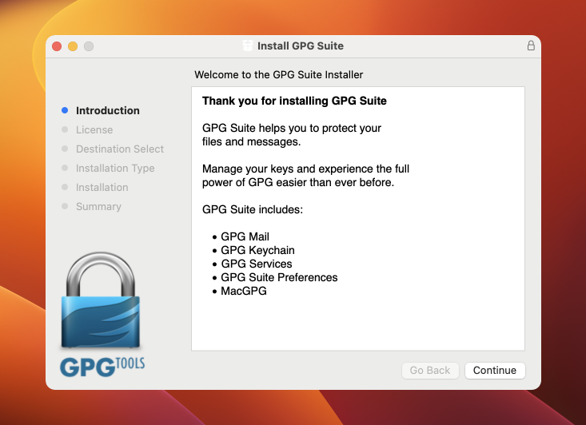
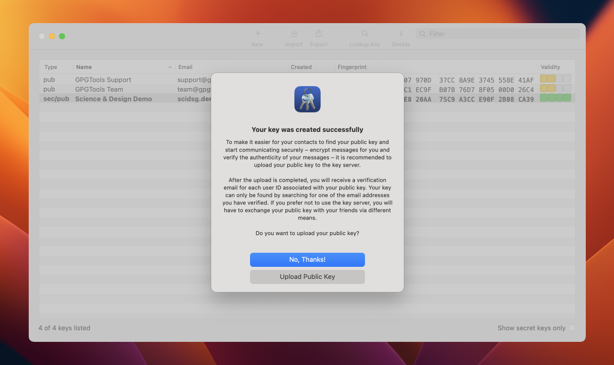
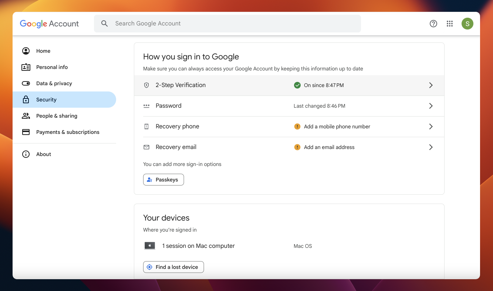
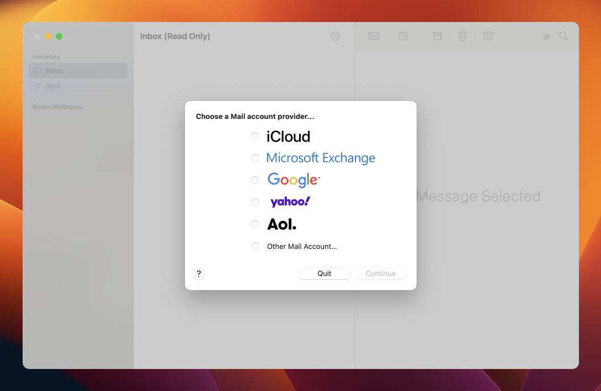
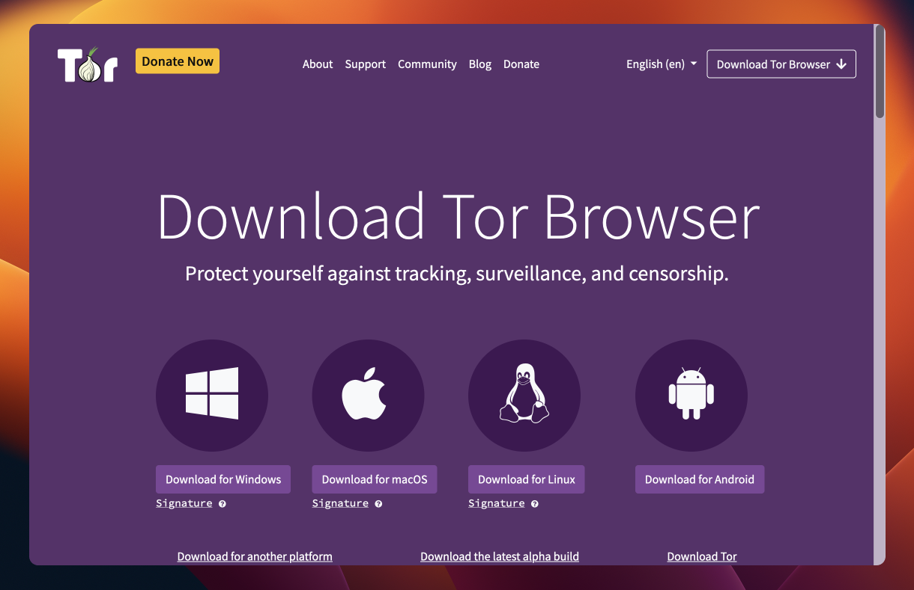

# MacOS

## Software in this guide
* [GPGTools](https://gpgtools.org)
* [Tor Browser](https://torproject.org/download)
* [Gmail](https://gmail.com)

## GPGTools
Hush Line uses PGP to protect your messages. The GPG Suite desktop application contains all the tools you need to create keys and decrypt your messages.

### Step 1: Download and Install GPG Suite
Go to `https://gpgtools.org` and download the GPG Suite. Run the downloaded files to install the suite.

### Step 2: Create and Upload Your Keys

- Press Command + Spacebar to open Spotlight and search for GPG Keychain.
- Click "New" at the top of the window. Enter the email address you want messages to be encrypted to, then create a strong password.
- After creating the keys, you'll see a dialog with the option to upload your public key. Choose this so Hush Line can find your key to encrypt incoming messages.
- Before it's discoverable online, you'll need to verify your email address. Go to the email account you entered and look for a message from `keyserver@keys.openpgp.org`. 
- After verifying your address, you'll be brought to a site confirming that your key has been published. Click your email address to get your key's URL. You'll see an address that looks like this:  `https://keys.openpgp.org/vks/v1/by-fingerprint/F75C5CEF4E358AE820AA75C9A3CCE90F2B08CA39`. Copy this address into a notepad.
- Now, anyone can send an encrypted message to you with your public key, and the only way to decrypt and read the message is to have your computer, private key, and the key's password.

## Email Setup

###  Step 3: Gmail App-Password

For Hush Line to send your message, it needs an SMTP-compatible email address. We'll use Google's Gmail.

- So that we don't leak our real password, we will create an app-password. Click on your avatar, then "Manage your Google Account."
- On the left column, click "Security," then scroll to 2-Step Verification.
- You'll need to configure 2-Step Verification to get an app 
password.
- Next, back on the Security tab, find and click on 2-Step Verification again. 
- Scroll to the bottom and look for "App passwords." Create a new password for Hush Line and copy it to a notepad.

### Step 4: Apple Mail

GPG Suite integrates with Apple Mail so you can seamlessly and automatically decrypt your Hush Line messages.

- Press Command + Spacebar to use Spotlight to search for Mail. 
- Click on Google and log in to receive messages sent to your Gmail account.

## Tor

### Step 5: Tor Browser

In order to access your Hush Line for a Tor-only install, you'll need Tor Browser. Head to [https://torproject.org/download](https://torproject.org/download) to download it. 

## Conclusion

🎉 Congratulations! You just set up everything you need to prepare to install Hush Line!