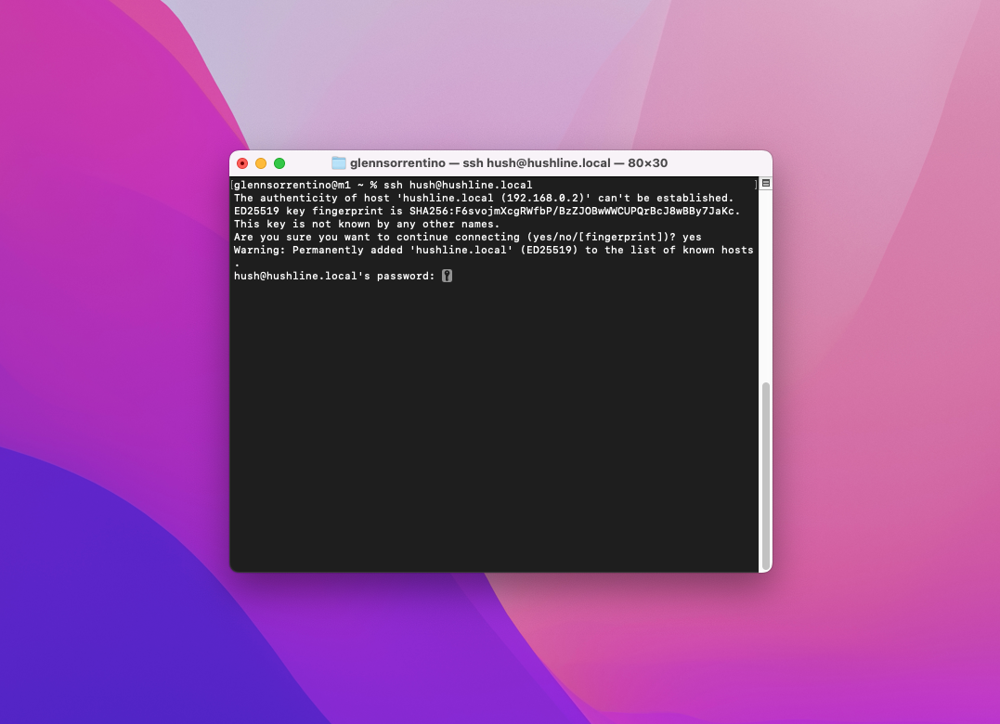

# Raspberry Pi Prerequisites 

## Hardware

- **Hardware:** [Raspberry Pi 4](https://www.amazon.com/Raspberry-Model-2019-Quad-Bluetooth/dp/B07TC2BK1X/?&_encoding=UTF8&tag=scidsg-20&linkCode=ur2&linkId=ee402e41cd98b8767ed54b1531ed1666&camp=1789&creative=9325)/[3B+](https://www.amazon.com/ELEMENT-Element14-Raspberry-Pi-Motherboard/dp/B07P4LSDYV/?&_encoding=UTF8&tag=scidsg-20&linkCode=ur2&linkId=d76c1db453c42244fe465c9c56601303&camp=1789&creative=9325)
- **Power:** [Raspberry Pi USB-C Power Supply](https://www.amazon.com/Raspberry-Pi-USB-C-Power-Supply?&_encoding=UTF8&tag=scidsg-20&linkCode=ur2&linkId=1b23995f6048ad84182dca1f160656e9&camp=1789&creative=9325)
- **Storage:** [Micro SD Card](https://www.amazon.com/SanDisk-128GB-MicroSDXC-Memory-Adapter/?&_encoding=UTF8&tag=scidsg-20&linkCode=ur2&linkId=fd8f40cfc6e84e328e3246af7159eb40&camp=1789&creative=9325)
- **SD Card Adapter:** [SD Card Reader](https://www.amazon.com/SanDisk-MobileMate-microSD-Card-Reader?&_encoding=UTF8&tag=scidsg-20&linkCode=ur2&linkId=40c1d3e78e132a951b46e61aab13e4e7&camp=1789&creative=9325) 

## Prepping Your Pi

If you didn't know, your Raspberry Pi doesn't come with an operating system. Don't panic! We're going to install one now called Raspberry Pi OS.

### 1. Raspberry Pi Imager

Like a Macbook runs MacOS, and a Dell runs Windows, a Raspberry Pi runs Linux, which comes in many different flavors depending on your needs. Since we're using a Raspberry Pi, we'll use Raspberry Pi OS (64-bit), an operating system made just for the Pi. The Imager installs the operating system onto your microSD cardc where we'll set up Hush Line. Download it from https://www.raspberrypi.com/software/.

## Prep Your Card

### 2. Install Raspberry Pi OS
Open the Raspberry Pi Imager and click `Choose OS > Raspberry Pi OS (other) > Raspberry Pi OS (64-Bit)`.

Insert your microSD card into your computer, and then click `Choose Storage` and select your card.

Before clicking Write, click on the Settings gear in the bottom right of the window. Configure the following settings:

- Change "Image customization options" setting to "to always use"
- Hostname = hushline
- Enable SSH with password authentication
- User = Hush
- Set a strong password
- Wifi settings

## Boot up and log in to Your Pi

### 3. Insert microSD Card

Take your SD card and insert it into your Raspberry Pi. You'll find the SD card slide on the bottom of the board, opposite the ethernet ports.

Plug the power supply into the device and let it boot up.

### 4. Log In

On a Mac, open Spotlight search by pressing CMD + Space. Enter "Terminal" and select the application with the same name. 

Enter `ssh hush@hushline.local`, and when prompted, enter the password you created in the first step.

🎉 That's it, you're ready to get started with Raspberry Pi!
