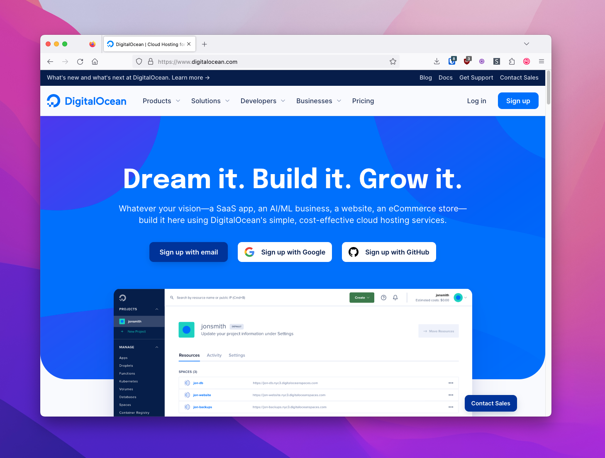
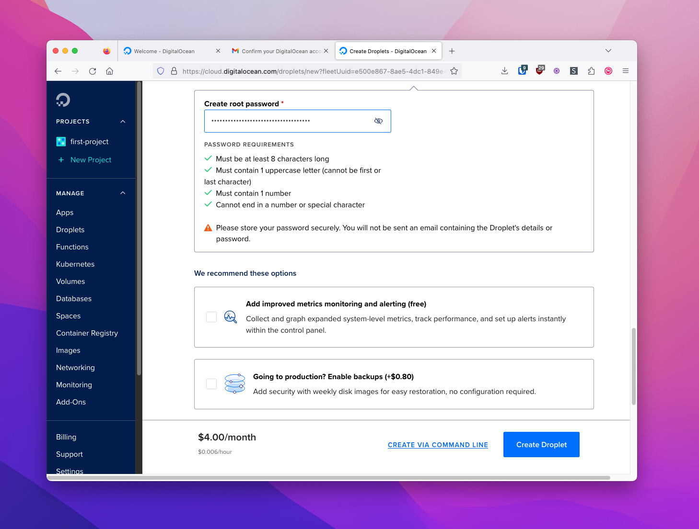
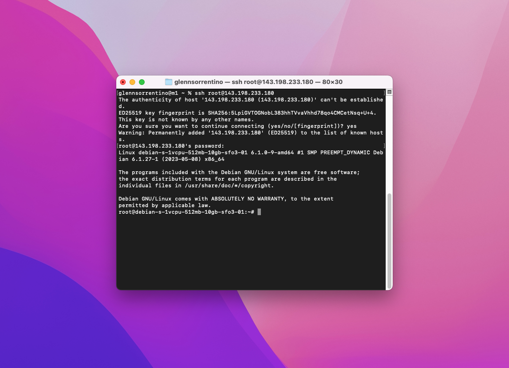

# VPS Prerequisites

In this section, we'll prepare to install Hush Line on a virtual private server (VPS). This means your Hush Line will run on a rented, private server owned by a company like [Digital Ocean](https://www.digitalocean.com/).

You'll need the following things:

1. Debit or credit card
2. Digital Ocean, or any other VPS provider

## Digital Ocean

Digital Ocean is an infrastructure service provider that provides a cost-effective way to create your first virtual private server (VPS).

### 1. Create an Account

Go to [digitalocean.com](https://www.digitalocean.com/) and create an account. You'll need to enter payment information before you can create a VPS.

### 2. Create a VPS

Digital Ocean calls their VPS option Droplets. To create a droplet click the green "Create" button at the top of the screen, the click "Droplets."

You can configure your server to your desired specifications, but for this guide, we'll choose the following options:

- Location: San Francisco
- Image: Debian 12
- Size: Basic
- CPU: Regular SSD @ $4/mo

Create a strong password, then click "Create Droplet."

After a minute or two, your Droplet should be ready. The "Resources" tab should be visible, and just below, you'll see the IP address for your Droplet.

### 3. Log In

On a Mac, open Spotlight search by pressing CMD + Space. Enter "Terminal" and select the application with the same name.

Enter `ssh root@<IP Address>`, and when prompted, enter the password you created in the second step.

### 4. Update your system

The last thing we need to do is to update our system. Enter `apt update && apt -y dist-upgrade && apt -y autoremove`.

🎉 Congratulations, you're now ready to install Hush Line on Digital Ocean!
