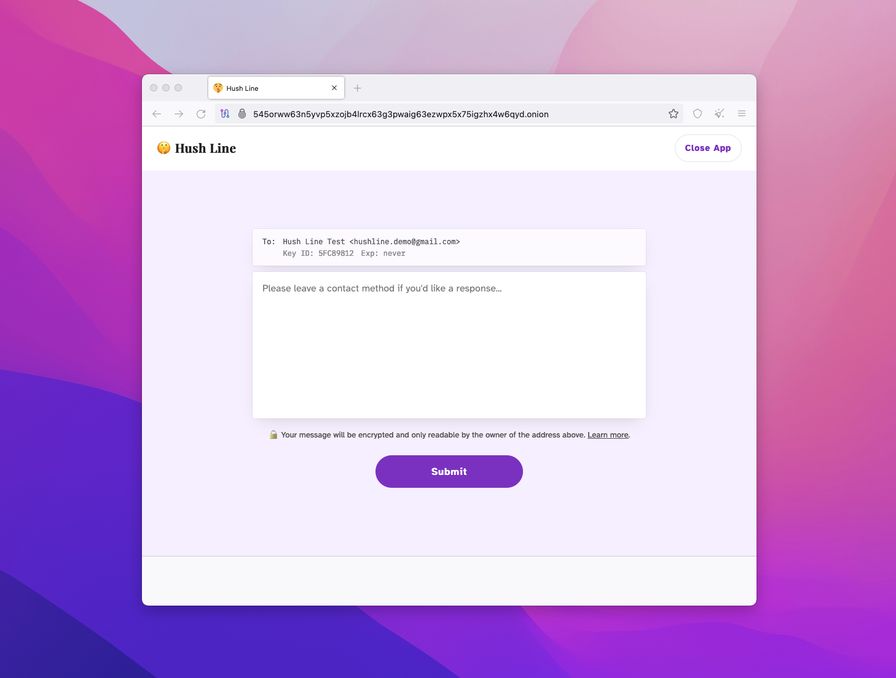

# Sending Messages

For someone in your community to send you a Hush Line message, they just need to go to one of your addresses. 

## 1. Tor

If you chose a Tor-only deployment, you should have seen an output like this after installation was completed:

```
✅ Installation complete!

Hush Line is a product by Science & Design.
Learn more about us at https://scidsg.org.
Have feedback? Send us an email at hushline@scidsg.org.

• Hush Line is running
http://5450rww63n5yvp5xzojb41rcx63g3pwaig63ezwp×5x75igzh×4w6qyd…onion
```

Open up Tor Browser and paste your onion address in the address bar. Tor is a little slower than regular internet, so it'll take a few seconds before your site loads.



## 2. Public Websites

If you deployed Hush Line to a public website, you should have seen an output like this:

```
✅ Installation complete!

Hush Line is a product by Science & Design.
Learn more about us at https://scidsg.org.
Have feedback? Send us an email at hushline@scidsg.org.

● Hush Line is running
https://ourdemo.app
http://jnaoywuss3dbgrmroeoqtsjymzf46in7lzh3bx6nwv3bzvwmhdvqytad.onion
```

In the example above, the first and last addresses can load in regular browsers like Chrome, Firefox, or Safari. The onion-only address needs Tor Browser to load.


